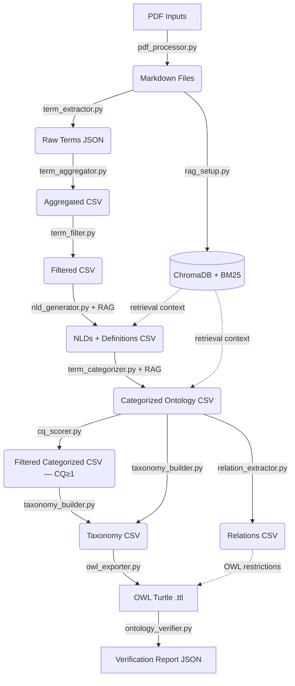

# System Context & Architecture

## Overview
This pipeline allows geoscientists to extract, define, and classify terminology from unstructured PDF documents, producing a formal OWL ontology anchored to published upper ontologies (BFO, GeoCore, GeoReservoir). It follows a 7-step sequential pipeline. Each step reads from `output/` (or `inputs/`) and writes to `output/`.

## Architecture



## Theoretical Grounding

The core contribution of this pipeline — using Natural Language Definitions (NLDs) to classify domain entities into upper ontology concepts — is grounded in:

> Lopes Junior, A.G. (2024) *"Automatic Classification of Domain Entities into Top-Level Ontology Concepts Using Natural Language Definitions"* (PhD thesis, PPGC/UFRGS)

Key validated findings that justify our design choices:

- **NLDs outperform all other textual representations** (term-alone, raw definition, example sentences) for classifying entities into BFO and DOLCE-Lite-Plus concepts, achieving >90% macro-F1 in best-case conditions.
- **Aristotelian form ("X is a Y that Z")** produces tighter semantic embedding clusters than free-form text, reducing polysemy and explicitly anchoring the proximate genus (Y) — the same genus used to name intermediate taxonomy nodes.
- The thesis used pre-existing human-curated NLDs from OBO Foundry and BabelNet. **This pipeline extends the approach** by RAG-augmenting an LLM to *generate* domain-specific NLDs from the Pre-Salt petroleum geology literature, then using those NLDs for classification.

**Ablation study mapping to thesis findings:**

| This pipeline | Thesis Study Case 1 |
|---|---|
| Condition A vs C (NLD contribution) | NLD > definiendum (term-alone) |
| Condition A vs B (RAG contribution) | Domain-specific NLD > generic NLD |
| Condition A vs D (NLD structuring) | Structured Aristotelian NLD > raw context |

---

## Competency Questions

The ontology scope is defined by 10 competency questions (CQs) that specify what the ontology must be able to answer. These guide both the iterative refinement process and the final evaluation. The canonical list lives in `resources/competency_questions.txt`.

| ID | Question |
|---|---|
| CQ1 | What are the geological objects of the Pre-Salt domain? |
| CQ2 | What earth materials constitute the Pre-Salt geological objects? |
| CQ3 | What geological structures occur in the Pre-Salt geological objects? |
| CQ4 | What post-depositional processes and structures occur in the Pre-Salt geological objects? |
| CQ5 | What are the spatial relations and arrangements in the Pre-Salt domain? |
| CQ6 | What are the dimensions and positions of the Pre-Salt geological objects? |
| CQ7 | What types of boundaries exist and where are they in the Pre-Salt geological objects? |
| CQ8 | What deposits and stratigraphic units are associated with Pre-Salt reservoirs? |
| CQ9 | What are the petrophysical characteristics of Pre-Salt reservoirs? |
| CQ10 | What geological age is associated with the Pre-Salt reservoir intervals? |

---

## Module Responsibilities

### `src/utils/pdf_processor.py` — Step 0: Ingestion
- **Tech**: `pymupdf4llm`
- Converts binary PDFs into clean Markdown, preserving headers and structure.
- Output: `inputs/*.md`

### `src/utils/rag_setup.py` — Step R: RAG Infrastructure
- **Tech**: BGE-M3 dense embeddings (ChromaDB), BM25 sparse retrieval, BGE-Reranker-v2-m3 cross-encoder
- Hybrid retrieval: BM25 (k=20) + ChromaDB (k=20) fused with Reciprocal Rank Fusion (RRF, k=60), then cross-encoder reranks top-20 down to top-5.
- Text splitter: `RecursiveCharacterTextSplitter` with `chunk_size=1024` **characters** (not tokens), `chunk_overlap=100`.
- ChromaDB is cached to `chroma_db_{chunk_size}/` (e.g., `chroma_db_1024/`) on first run. BM25 is always rebuilt in-memory.
- Provides retrieval context to Steps 4 (NLD generation) and 5 (categorization).

### `src/modules/term_extractor.py` — Step 1: Extraction
- **Tech**: gpt-5.4 (Azure AI Foundry; default, configurable via `LLM_EXTRACTION_MODEL`)
- Reads Markdown files and extracts candidate geological terms via a structured LLM prompt.
- Output: `output/1_raw_llm_extraction.json`

### `src/modules/term_aggregator.py` — Step 2: Aggregation
- **Tech**: spaCy lemmatization
- Deduplicates and counts term occurrences across all documents using lemmatization.
- Output: `output/2_aggregated_counts.csv`

### `src/modules/term_filter.py` — Step 3: Quality Control
- Applies a minimum document-frequency threshold (`MINIMUM_FREQUENCY_FILTER`, default 5). Since the LLM extracts each term at most once per paper, Frequency equals the number of distinct papers mentioning that term (document frequency). A threshold of 5 for an 82-paper corpus (~6%) retains terms that reflect cross-author consensus while excluding idiosyncratic or peripheral terminology.
- **Threshold rationale:** The threshold was selected after examining the frequency distribution of the 82-paper corpus (gpt-5.4 extraction): freq≥5 yielded 407 well-focused domain terms, freq≥7 yielded 265 terms (dropping legitimate concepts with narrower but significant coverage), and freq≥10 yielded 157 terms. The choice of freq≥5 (≈6% of the corpus) balances coverage against noise — manual inspection confirmed the terms entering at freq 5–6 are legitimate domain concepts (e.g. accommodation zone, calcimudstone, carbonate build-up), with generic noise ("bedding", "accommodation") only appearing at freq≤3. Downstream quality filters (NOT_CLASSIFIED removal at Step 5, cycle detection at Step 6) provide additional robustness, so the threshold does not need to be perfect — it needs to be reasonable.
- **Note (model change, 2026-07 — removable):** The threshold was previously freq≥7, chosen on the earlier *Gemini* extraction, which yielded 976 / 614 / 368 terms at freq≥5 / 7 / 10. Migrating to gpt-5.4 produced a leaner, more consolidated extraction (~43% as many terms at every threshold), so freq≥7 now yields only 265 terms. The threshold was re-derived on the new distribution and lowered to freq≥5 (407 terms) to preserve ontology coverage and Layer-2 expert-evaluation headroom (the expert workbook samples 200 terms). Remove this note once the change is settled in the thesis narrative.
- Output: `output/3_filtered_top_terms.csv`

### `src/modules/nld_generator.py` — Step 4: Definition Generation
- **Tech**: Gemini 2.5 Pro + RAG retrieval
- For each filtered term, retrieves the top-5 most relevant corpus chunks via hybrid search.
- Generates an Aristotelian NLD ("X is a Y that Z") grounded in the retrieved context.
- Few-shot examples and an English-language/polysemy instruction are included in the system prompt.
- **Robustness:** Required environment variables (`FILTERED_TERMS_OUTPUT`, `CONSOLIDATED_LLM_RESULTS_WITH_NLDS`, `OUTPUT_FAILURE_FILE`) are validated at startup with clear error messages. JSON parse failures set `Context_Used = false` (boolean) rather than a string sentinel. All CSV reads use `utf-8-sig` encoding for BOM-safe interoperability.
- Output: `output/4_nld_generated_definitions.csv`

### `src/modules/term_categorizer.py` — Step 5: Ontology Classification
- **Tech**: Gemini 2.5 Pro + RAG retrieval
- Classifies each term+NLD into one of N upper-ontology categories using an N-tier waterfall driven by `cfg.waterfall_ontologies()`. For Pre-Salt the cascade is GeoReservoir → GeoCore → BFO, with `NOT_CLASSIFIED` as the documented fallback. The categories list and per-category definitions are injected into the prompt as the single `{categories_block}` placeholder rendered by `cfg.categorization_block()`; no category names are hardcoded in the module.
- Waterfall priority ensures each term maps to the most domain-specific applicable namespace first. Reordering or extending the cascade is a YAML-only edit (`waterfall:` + a new `ontologies.<key>` block) — no Python change is required.
- **Realizables are not assignable here.** The BFO realizables `role`, `disposition`, and `function` are flagged `categorizer: false` in `ontology_config.yaml`, so they are omitted from the `{categories_block}` menu and from `categories_for()`. Terms that bear a role/function are categorized as their material bearer (e.g. a rock body → `object`), and the realizable is introduced only later by the validate-step critic via `KEEP_AS_BEARER` minting + OntoClean bucketing. This preserves the critic's bearer-preservation mechanism, which a Step-5 role-typing would otherwise defeat. `quality` remains assignable at Step 5 (genuine qualities like porosity/permeability are reliable there; pseudo-qualities are handled by the critic's `DROP_AS_MIXIN`). The flag does **not** remove metatypes, so these classes stay valid relation domain/range targets, taxonomy parents, and critic REPARENT/mint targets.
- Output: `output/5_categorized_ontology.csv`

### `src/modules/classify/cq_scorer.py` — Step 5b: CQ-Driven Refinement
- **Tech**: Gemini 2.5 Pro (synonym triage + CQ scoring)
- Mandatory sub-step of the `classify` verb. Runs after Step 5 and before Step 6; downstream steps consume its filtered output instead of the raw Step 5 CSV.
- **Sub-step A — Deterministic cleanup:** Detects encoding/accent duplicates (Unicode NFKD normalisation) and hyphenation variants (build-up/buildup). Merges to the longer/accented canonical form.
- **Sub-step B — Synonym triage:** Groups terms sharing a head noun within the same category (≥50% word overlap). Sends clusters to the LLM for 3-way classification: SYNONYM (merge to canonical), SPECIALIZATION (keep both + emit parent-child hint), or DISTINCT (keep both). NLDs are included so the LLM judges meaning, not just surface form. SPECIALIZATION pairs are written to `5b_specialization_hints.csv` and passed to the taxonomy builder as parent-child constraints.
- **Sub-step C — CQ scoring:** Each surviving term is scored against 10 competency questions in parallel batches of 5 (`CQ_BATCH_SIZE`). The LLM returns which CQs the term meaningfully contributes to. Checkpoint/resume via `5b_cq_matrix.csv`.
- **Sub-step D — CQ filter:** Drops every term whose `CQ_Count < 1` (i.e. terms that didn't contribute to any of the 10 competency questions). Writes the kept terms to `classify_categories.csv` inside a `refined/` subfolder next to the Step 5 input (production: `output/refined/classify_categories.csv`; e2e test sandbox: `test/output_test/refined/classify_categories.csv`). All downstream verbs (construct → validate → emit) follow the same `refined/` directory so the entire post-classify pipeline is colocated and easy to clean. There is no threshold sweep — production targets T≥1.
- **Robustness:** Output paths are rebased at function entry (`_rebase_paths(input_csv)`) so the test sandbox and production share one code path. CQ identifiers are validated against a fixed set (CQ1-CQ10). Batch size mismatches raise `ValueError`. JSON parse failures are logged and skipped. ThreadPoolExecutor parallelism is configurable via `MAX_CONCURRENT_CQ`.
- Output: `<refined>/5b_cleanup_report.csv`, `<refined>/5b_cq_matrix.csv`, `<refined>/5b_specialization_hints.csv`, `<refined>/classify_categories.csv`

### `src/modules/construct/taxonomy_builder.py` — Step 6: Taxonomy Construction
- **Tech**: Gemini 2.5 Pro
- Builds a hierarchical taxonomy per ontology group (GeoReservoir, GeoCore, BFO) using NLDs for naming.
- Accepts optional `hints_csv` parameter with pre-identified SPECIALIZATION pairs from Step 5b. When provided, these are injected into the prompt as parent-child constraints.
- Processes terms in chunks of up to 150 per LLM call to avoid cross-chunk inconsistency.
- **Cycle detection:** After each LLM response, parent-chain walks detect any cycles (A→B→A). Cyclic terms are re-parented to the category root with a warning log.
- **Casing/IRI-collision dedup (two tiers):** the LLM may mint a Title-Case intermediate genus (e.g. `Pore Space`) that collides — case-insensitively, by the *same* normalisation emit uses to mint IRIs — with a real categorized term (e.g. `pore space`). The per-group pass (`build_taxonomy_for_group`) drops such an intermediate when the collision is **within one category** (the input term wins; it owns the NLD). Because the taxonomy is built one category at a time, a second **global** pass (`_dedupe_cross_category_collisions`) runs after all categories are assembled and resolves **cross-category** collisions: a real term (`Is_Intermediate=False`) is canonical over any colliding intermediate, intermediate-vs-intermediate ties break by a stable domain-agnostic sort, references (`Parent_Term`) to a dropped variant are rewritten to the survivor, and the duplicate rows are removed. This enforces "one OWL IRI = one class" at the source, preventing emit from later collapsing the variants onto one IRI and silently unioning their (often BFO-disjoint) parents — which made the reasoner inconsistent.
- Prompt anchors intermediate node names to canonical UPPER_IRIS vocabulary (55 published IRIs from BFO/GeoCore/GeoReservoir), and instructs the LLM to use the Aristotelian genus from NLDs ("X is a Y that Z" → use Y as intermediate node name).
- **UPPER_IRIS invariant**: every entry must map to a unique published IRI. A module-level assertion raises `RuntimeError` if a duplicate is detected, because aliases would corrupt the OWL exporter's label map and overwrite canonical `rdfs:label` values in the final ontology.
- **Class vs. individual distinction is resolved here:** named geological time periods (Aptian, Cretaceous), petroleum fields (Lula Field, Búzios), basins (Santos Basin), and formations are assigned `rdf:type` (OWL individuals); generic types/kinds (Grainstone, Fault, Porosity) are assigned `rdfs:subClassOf` (OWL classes).
- NLDs are carried forward into the output CSV as a column for OWL annotation.
- Output: `output/6_taxonomy.csv`

### `src/modules/relation_extractor.py` — Step 6b: Relation Extraction
- **Tech**: Gemini 2.5 Pro + `relation_validator.py`
- Extracts ontological relations from NLDs using 16 Tier 1 BFO/RO properties (has_part, part_of, has_participant, participates_in, occurs_in, located_in, derives_from, derives_into, generated_by, constituted_by, has_quality, inheres_in, preceded_by, precedes, generated_in, has_age).
- Processes terms in batches of 10 (configurable via `RELATION_BATCH_SIZE`).
- 3 few-shot examples guide extraction; confidence threshold filters weak relations (≥0.7).
- Post-hoc property specialisation: generic `has_part`/`part_of` upgraded to BFO-precise `has_continuant_part`/`has_occurrent_part` based on subject/filler metatypes.
- Filler source resolution: deterministic Python-side tagging (`domain_term` vs `external`).
- **Robustness:** Checkpoint/resume with single flat CSV. Batch size mismatch raises `ValueError`. Unknown properties are rejected.
- Output: `output/refined/construct_relations.csv`

### `src/modules/validate/critic.py` — validate: Focused Staged Critics per Category
- **Tech**: gpt-5.4. Focused calls run sequentially (taxonomy correctness → class worthiness → dedup → facet/frame audit → relation correctness → relation scope); categories run in parallel via `ThreadPoolExecutor`.
- **Evidence bundle:** `validate_evidence_bundle.csv` joins frequency/document coverage and CQ matches to taxonomy rows before criticism, so centrality is evidence-based rather than guessed.
- **Focused lateral stages:** `critic_class_worthiness.txt` decides primitive/defined/demote/drop; `critic_facet_frames.txt` handles subsumption, singleton groups, frame diagnostics and completion proposals; `critic_frame_completion.txt` accepts only corpus-attested missing kinds; `critic_relation_scope.txt` classifies corrected relations independently of property/filler correctness.
- **Deterministic ancestry repair:** children of a dropped parent follow its survivor/new parent or nearest surviving ancestor; category-root fallback is last resort.
- Replaces the legacy multi-pass critic (`ontology_critic`) and the deterministic relation reclassifier (`relation_reclassifier`). The work is split into focused calls so each prompt does one job:
  - **Taxonomy critic — Stage 1, per-term, CHUNKED** (`critic_taxonomy.txt`): judges IS-A rows, emitting one verdict per row (`KEEP | REPARENT | KEEP_AS_BEARER | DROP_AS_MIXIN | DROP_AS_REDUNDANT | CONVERT_TO_INSTANCE`). Runs in small chunks of `CRITIC_TAXONOMY_CHUNK_SIZE` terms (default 5) so each call reasons about only a handful of terms. Each chunk sees its terms + NLDs, those terms' own/ancestor relations as **read-only context** (for Probe 3 and REPARENT evidence), the **parents' NLDs** (to judge vacuous restatement even when the parent is in another chunk), and the allowed target-class list. It also runs an **OntoClean parent–child edge check** from the parent NLDs: rigidity and dependence drive REPARENT of mis-parented terms, while identity is **advisory-only** (recorded but never acted on alone, and skipped on BFO SDC/occurrent branches where `-I` is normal). It buckets the differentia by BFO category including **Disposition** (the internally-grounded realizable, distinct from Quality and Role). **Option-E output:** each row carries a probe trace (`probe1_genus_ok`, `probe2_bucket`, `probe3_rewrite`) plus the OntoClean signs (`rigidity`, `identity`, `dependence`) that force the reasoning before the verdict; every `DROP_AS_MIXIN` carries a `carried_by` recording the BFO entity the differentia encoded (logged for audit; the term is removed and `carried_by` is not re-emitted as an axiom). Here `DROP_AS_REDUNDANT` is **parent-collapse only** — a term that vacuously restates its parent (the survivor cited in a `survivor` field is the parent). **`KEEP_AS_BEARER`** keeps a *material bearer* whose differentia is a realizable/quality (Probe-2 bucket `Role` / `Function` / `Disposition` / `Quality`) under its **material genus** rather than reparenting it onto `role` (which would strand its material parthood relations and desync its `Category`): the differentia moves off the IS-A edge onto a **companion axiom** — `_apply_taxonomy_edits` keeps the bearer and `_materialize_bearer_carries` mints a filler class (`<Bearer>Role ⊑ role`, etc.) plus a `<bearer> has_role / has_quality / … some <filler>` relation, so unlike `DROP_AS_MIXIN` this `carried_by` **is** re-emitted as an axiom. The companion filler is only ever a **freshly-minted** realizable/quality class: `_apply_taxonomy_edits` rejects (to `KEEP`) any carry whose filler collides with an existing class — an upper-ontology class (we never retype a published ontology, e.g. minting `Geological Structure ⊑ quality` would make GeoCore inconsistent) or a pre-existing domain term — so the carry can never mutate a class it does not own. A conservative guard reserves it for substantial bearers; a vacuous `<genus> + <property>` bundle still `DROP_AS_MIXIN`. Because the bearer stays material, its `Category` and parent agree (no role-reparent desync) and its material relations stay valid.
  - **Dedup critic — Stage 2, cross-term** (`critic_taxonomy_dedup.txt`): one call over all of a category's survivors together, making the two decisions that need a global view: sibling near-synonym / co-extensional redundancy and **intermediate value**. The intermediate check is **value-based, not count-based**: a builder-minted genus is KEPT iff it is a *rigid sortal* (a real kind that carries its own identity, judged from its NLD) and DROPPED if it is a *mixin* (groups children by a shared property / origin / history / use) or a *role / phase* — **even when it has ≥2 children**. A Python-computed `child_count` is still passed in, but only as a **secondary** signal: it collapses a rigid-sortal one-off bridge that merely wraps a single child (pure indirection). It emits only `DROP_AS_REDUNDANT`, each citing the `survivor` it collapses into. Skipped when fewer than two survivors remain. A **mutual-drop guard** then un-drops any term whose cited survivor (the `survivor` field, or, for Stage-1 parent-collapse, the row's parent) was itself dropped, so a concept can never lose its last representative.
  - **Relation critic — Stage 3** (`critic_relations.txt`): judges object-property rows (`KEEP | DROP | FIX`; `FIX` may carry a `mint` block). It sees the relations + menu (the relations flagged `critic_menu: true` in `ontology_config.yaml` — 21 for Pre-Salt; mereology is offered only in generic form, `has_part`/`part_of`) + previously minted properties, the taxonomy NLDs as context, and a **handoff** of the merged stage 1–2 decisions so its edits stay consistent (e.g. it knows a term is now an individual, or was dropped).
- **Post-critic mereology normalisation:** specialised parthood (`has_continuant_part` vs `has_occurrent_part`) is a pure function of the subject/filler metatypes and must stay correct after any FIX. After the relation edits are applied, every surviving relation's property is genericised then re-specialised against its current subject/filler categories (`relation_validator.normalize_property`). This makes correct mereology an invariant regardless of what the critic did, so the critic only ever reasons about generic `has_part`/`part_of`.
- **Completeness guard:** after each taxonomy (Stage 1) and relation (Stage 3) call, the set of returned ids is diffed against the ids sent; any omitted id is re-asked once (only the missing rows). Rows still missing fall back to implicit `KEEP`. This prevents large categories from being silently under-reviewed. The Stage-2 dedup call has no completeness guard — it emits only drops, so a sparse or empty response simply means "keep everything".
- **REPARENT:** evidence-based — the model moves a term only when its NLD or relation context justifies a better genus, citing the evidence in `reason`. (The earlier hard ≥2-citation floor was removed; REPARENT is non-destructive and fully logged.)
- **CONVERT_TO_INSTANCE flow:** the row is removed from `validate_taxonomy.csv` and recorded in `validate_instances.csv` with `Term, Target_Class, Mint_Parent, Original_Category, Original_Parent, Reason`. `Target_Class` is chosen from the upper-class list; if nothing fits the model may name a new class plus a `mint_parent`. The OWL exporter resolves the target against `cfg.upper_iris()` or mints `<project>:<Target_Class> ⊑ <mint_parent>`, then emits the term as `owl:NamedIndividual`.
- **FIX / minting flow:** when no menu property fits, the relation critic mints a new ObjectProperty (with `parent_property`, `domain`, `range`, `justification`). Mints are persisted to `validate_minted_properties.csv` (deduplicated on IRI across runs) and re-loaded into the menu on the next run, tagged provenance `critic_minted`.
- **Phantom-filler cleanup:** after taxonomy edits are applied, any relation whose `Filler` matches a DROPped term is also dropped and recorded as `DROP/phantom`, preventing the OWL exporter from materialising orphan filler classes under `owl:Thing`.
- **Minted filler NLDs:** every KEEP_AS_BEARER carry also supplies a `filler_nld` — a one-sentence Aristotelian definition of the minted filler class (e.g. `ReservoirRole → "A role that is borne by a petroleum reservoir rock …"`). `_materialize_bearer_carries` writes it to the filler row's `NLD` so the OWL exporter emits an `rdfs:comment`; when the critic omits or errors on it, a deterministic template (`_BEARER_NLD_TEMPLATES`, keyed by BFO genus — "A role/function/disposition/quality that inheres in a `<bearer>`.") is used as a guaranteed floor, so no minted class is ever left without a definition.
- **Defined/demoted classes:** the dedicated class-worthiness critic may keep a central cross-axis concept as `KEEP_AS_DEFINED`, or remove a property-value refinement as `DEMOTE_TO_PROPERTY`. Defined classes become `owl:equivalentClass`; demotions are written to `validate_demotions.csv` for audit and never asserted universally on the base class.
- **Facet/frame audit:** Stage 2b can REPARENT to existing classes, collapse useless singleton intermediates, diagnose same/mixed-axis frames, and propose completion candidates/disjointness. Completion terms are added only after distinct-document corpus attestation and evidence-grounded LLM verification.
- **Relation scope:** property/filler correctness and quantificational scope are separate calls. Corrected rows carry `Relation_Scope`, `Scope_Reason`, confidence, and review metadata; only generic relations meeting `min_confidence_emit` are emitted as class restrictions when configured.
- **Safety guards:** children of dropped parents follow explicit survivors/new parents or the nearest surviving ancestor; category root is last resort. Missing LLM rows are re-asked, then conservatively kept.
- **Archive:** every raw LLM response is appended to `output/refined/validate_responses_archive/<timestamp>.jsonl` (one row per call, tagged `call: taxonomy|relation`) for post-hoc inspection.
- **Audit log:** `validate_edits.csv` records every decision; taxonomy rows additionally carry the probe trace + OntoClean signs (`probe1_genus_ok`, `probe2_bucket`, `probe3_rewrite`, `rigidity`, `identity`, `dependence`, `carried_by`).
- Outputs additionally include `validate_evidence_bundle.csv`, `validate_demotions.csv`, `validate_subsumption_hints.csv`, `validate_frame_completion.csv`, and `validate_lateral_coherence_summary.json` alongside the taxonomy/relation/edit/instance/defined/facet/disjointness artifacts.

### `src/modules/emit/owl_exporter.py` — Step 7: OWL Export
- **Tech**: `rdflib`
- Converts the taxonomy CSV to a Protege-compatible OWL Turtle file.
- `owl:Class` entries get `rdfs:label`, `rdfs:comment` (NLD, from the taxonomy CSV NLD column), and `rdfs:subClassOf` triples pointing to published BFO/GeoCore/GeoReservoir IRIs. **All presalt class and individual labels are Title-Cased** to the GeoCore/GeoReservoir house style (e.g. `Chemical Sedimentary Rock`, `Pre-Salt Sequence`, `Santos Basin`), with minor words (`of`, `the`, …) lower-cased and acronyms preserved; IRIs stay CamelCase. Object-property labels are left lower-case (BFO/RO convention).
- `owl:NamedIndividual` entries (named fields, basins, formations, time periods) get `rdf:type` triples pointing to their parent class.
- Intermediate (synthesised) nodes get `rdfs:label` only (no NLD comment).
- Accepted relations from Step 6b are encoded as `owl:Restriction` blank nodes (`owl:onProperty` + `owl:someValuesFrom`), adding existential axioms to domain classes.
- **Critic-driven additions** (auto-loaded from `<output_dir>` if present):
  - `validate_minted_properties.csv` → each row is emitted as `owl:ObjectProperty` with `rdfs:subPropertyOf <ParentProperty>`, `rdfs:domain <Domain>`, `rdfs:range <Range>`, `rdfs:label`, and `rdfs:comment "[critic_minted] <Justification>"`.
  - `validate_instances.csv` → each row is emitted as `owl:NamedIndividual rdf:type <Target_Class>` (target class resolved against `cfg.upper_iris()` by label, case-insensitive; rows with an unresolvable class are skipped with a warning).
  - `validate_defined_classes.csv` → `_emit_defined_bearer_classes` emits `bearer owl:equivalentClass [ owl:intersectionOf ( <genus> [<property> some <minted role>] ) ]` for each realizable KEEP_AS_BEARER bearer. The asserted `bearer ⊑ genus` (+ incidental restrictions like `has_quality`/`is_composed_of`) is kept for a browsable hierarchy and verifier anchoring; the loose role restriction is **skipped** in the relation loop so the role is encoded once, inside the definition (no double-encoding).
  - **BFO companion axioms:** every presalt class whose transitive `rdfs:subClassOf` chain includes BFO Quality gets `inheres_in some IndependentContinuant`; every Role descendant gets `realized_in some Process`. IRIs are resolved from `ontology_config.yaml` at call time, so a different domain profile can disable either side simply by omitting the relevant relation or class.
- **Upper-ontology backbone:** Parses reference OWL files (`bfo-core.owl`, `geocore-full.owl`, `geores-full.owl`) and walks parent chains to add `rdfs:subClassOf` triples anchoring GeoCore/GeoReservoir classes to their BFO roots, plus `rdfs:label` annotations for all intermediate upper-level IRIs.
- The ontology header declares `owl:imports` for every upper ontology whose config entry has an `import_iri` (BFO only, by default; GeoCore/GeoReservoir are referenced but not imported).
- **Property labels:** every object property used in a restriction or companion axiom is declared `owl:ObjectProperty` and given an `rdfs:label` (from the reference OWL files first, then the config relation name), so codes like `BFO_0000054` show their BFO label (`has realization`, with `realized in` as the `skos:altLabel`) in Protégé even when the imports do not resolve. Property labels stay lower-case.
- **Disjointness conflict detection & auto-repair:** After building the upper-ontology backbone, detects presalt: classes that inherit from both sides of a BFO disjoint pair (e.g., MaterialEntity ⊥ ImmaterialEntity). Uses the term's Category from the taxonomy to determine which parent lineage to keep and removes the conflicting `rdfs:subClassOf` edge. Runs up to 5 repair passes to handle cascading conflicts. Each repair is logged as a warning. BFO disjointness axioms are always added to the ontology. **Case-collision fallback:** when the term's Category resolves to a *third* branch disjoint with both conflict sides — the signature of a case-collision, where two taxonomy rows that normalise to one IRI (an LLM-invented intermediate genus plus a real term whose critic reparent points at a bare BFO metatype root) have their parents silently unioned across a disjoint boundary — the repair drops the parent edge that points **directly** at one of the two disjoint roots when the other side is reached only **transitively** via a substantive published genus. The bare-root edge is the artifact; the substantive genus is kept. This fallback only runs where the Category-based repair would otherwise give up, so it never alters a class the primary repair already resolves.
- **Why post-hoc repair rather than prevention?** The taxonomy builder (Step 6) uses an LLM to arrange terms into IS-A hierarchies within each category. The LLM assigns each term exactly one parent, but may create intermediate classes (e.g., "Geological Depression") to bridge the gap between a domain term and its category root. These intermediates are driven by geological reasoning — the LLM sees that a basin is a type of depression, and a depression is a spatial feature. However, the LLM has no awareness of BFO's formal disjointness axioms (e.g., MaterialEntity ⊥ ImmaterialEntity). When the OWL exporter adds the upper-ontology backbone (published GeoCore/BFO parent chains), an intermediate like "Geological Depression" may transitively inherit from the wrong BFO branch, creating a formal inconsistency that the LLM's geological reasoning cannot anticipate. Post-hoc repair is the correct design because: (1) **prevention is fragile** — instructing the LLM about formal disjointness constraints does not guarantee compliance, since natural-language geological reasoning and formal ontology reasoning are fundamentally different tasks; (2) **the repair is deterministic and principled** — it uses the Category from Step 5 as ground truth to identify which BFO branch each term belongs to, and removes only the edges that lead toward the wrong branch; (3) **the problem is rare** — in the 10-paper production run (2,482 triples), only 2 edges required repair (0.08%), both involving SedimentaryBasin's intermediate ancestor crossing from MaterialEntity to ImmaterialEntity. This architecture separates concerns cleanly: the LLM optimises for geological plausibility, while deterministic post-processing enforces formal ontological consistency.
- **Robustness guards:**
  - IRI generation normalises terms to lowercase before CamelCase conversion, preventing case-collision duplicates (e.g., "Carbonate Mineral" and "carbonate mineral" map to the same IRI).
  - UPPER_IRIS lookup is case-insensitive, so BFO/GeoCore/GeoReservoir terms are matched regardless of capitalisation.
  - **OWL-sourced labels are canonical**: `rdfs:label` values are taken from the published OWL files (`bfo-core.owl`, `geocore-full.owl`, `geores-full.owl`) and only fall back to UPPER_IRIS friendly names when an OWL has no label for an IRI. This prevents UPPER_IRIS aliases from overwriting the published label.
  - **Phantom filler guard**: if a relation's Filler is neither a known taxonomy term nor an upper-ontology IRI, the restriction is skipped and a warning is logged with the offending `term --[prop]--> filler` triples. This is a backstop for cases the critic should have handled.
  - Self-referential `rdfs:subClassOf` triples (term IRI = parent IRI) are detected and suppressed.
  - Upper→upper triple suppression: triples where both subject and object resolve to upper-level IRIs (BFO/GeoCore/GeoReservoir) are skipped. Only triples where at least one side is a presalt: entity are emitted — the pipeline does not alter published upper ontologies.
- Output: `output/7_ontology.ttl`

#### Axiom Coverage
The pipeline generates the following OWL axiom types:
- **SubClassOf axioms** (from Step 6 taxonomy): class hierarchy triples, e.g., `Grainstone rdfs:subClassOf SedimentaryRock`.
- **Existential restrictions** (from Step 6b relations): `owl:someValuesFrom` restrictions on object properties, e.g., `Dolomitization rdfs:subClassOf (has_participant some Calcite)`.
- **Type assertions** (from Step 6 taxonomy): named individuals get `rdf:type` triples, e.g., `SantosBasin rdf:type SedimentaryBasin`.
- **Disjointness axioms**: BFO-level `owl:disjointWith` triples between top-level categories.
- **Upper-ontology backbone**: `rdfs:subClassOf` chains linking GeoCore/GeoReservoir intermediate classes up to their BFO roots.

The following axiom types are **not generated** and are left for future work:
- **Cardinality restrictions** (`owl:minCardinality`, `owl:maxCardinality`): require domain expert curation not feasible from NLDs alone.
- **Equivalence axioms** (`owl:equivalentClass`): necessary-and-sufficient conditions carry high risk of incorrect ontological commitment when generated automatically.
- **Universal restrictions** (`owl:allValuesFrom`): "only" constraints are rarely extractable from natural language text.
- **Closure axioms**: depend on universal restrictions and complete domain knowledge.

The combination of taxonomy axioms and existential restrictions is the standard output level for ontology learning systems. More expressive axioms require manual ontological commitment beyond what automated NLD analysis can provide.

### `src/modules/ontology_verifier.py` — Step 7b: Ontology Verification
- **Tech**: `rdflib`, OOPS! REST API (optional), HermiT reasoner via owlready2 (optional)
- Post-export verification of the OWL artifact. No LLM repair — verification-only.
- **Layer 1 — Syntax**: Parses the Turtle file with RDFLib; reports parse errors with diagnostics.
- **Layer 2 — Structure**: Checks for self-referential `rdfs:subClassOf`, orphan classes (no parent), missing `rdfs:label`, missing `rdfs:comment` (NLD not propagated), and upper-ontology anchoring (BFO/GeoCore/GeoReservoir IRI count).
- **Layer 3 — OOPS! Pitfalls** (optional): Calls the OOPS! REST API if `OOPS_URL` env var is configured. Works with the remote API (`https://oops.linkeddata.es/rest`), a local Docker instance (`docker run -p 8080:8080 mpovedavillalon/oops:v1`), or any compatible endpoint.
- **Layer 4 — HermiT Reasoner Consistency** (optional): Invokes the HermiT reasoner via owlready2 to check ontology consistency. Converts Turtle → NTriples via rdflib for cross-platform compatibility. Reports PASS/FAIL with list of unsatisfiable classes. Requires Java (Eclipse Temurin JDK 21) and owlready2. Java path controlled by `JAVA_EXE` env var. Skippable with `--skip-reasoner` CLI flag.
- Issues are classified by severity: CRITICAL, IMPORTANT, MINOR.
- **Robustness:** Docker absence, container startup failures, API errors, missing Java, and HermiT invocation errors are caught and reported as warnings, never crashing the pipeline.
- Output: `output/7b_verification_report.json`

---

## Configuration — `domains/<name>/ontology_config.yaml`

The single source of truth for upper-ontology metadata, BFO disjoint pairs, relation property constraints, the categorization waterfall, and the critic-driven `validate` step's class budget. Loaded once at import time by `src/utils/ontology_config.py` (frozen dataclass + `lru_cache`-backed singleton). Default path: `domains/presalt/ontology_config.yaml`; override with `ONTOLOGY_CONFIG_PATH`. All modules read from `get_config()`; nothing else is hardcoded.

### Top-level keys
- `project`: `namespace`, `prefix`, `version`, BFO `import_iri`
- `waterfall`: ordered list of ontology keys (most-specific first) defining the Step 5 cascade. Rendered into the `{categories_block}` placeholder injected into the categorization prompt. Each entry must be a known ontology key with at least one metatype'd class.
- `provenance_tiers_active`: ordered list of relation provenance tiers to honour (default: all four)
- `ontologies`: per-ontology block (`bfo`, `geocore`, `georeservoir`, `ro`) with `display_name` (header used by `categorization_block()`), `namespace`, `prefix`, `owl` (file path), `import_iri`, `eval_tier`, and a `classes:` list (each class with `iri`, `label`, `metatypes`, `llm_definition`, optional `disjoint_pairs`, and optional `categorizer` — default `true`; set `categorizer: false` to keep a class as a relation/taxonomy target while excluding it from the Step-5 categorizer menu, as done for the BFO realizables role/disposition/function)
- `verifier_prefixes`: maps `bfo`, `geo`, `presalt` → URI prefixes used by `ontology_verifier.py`
- `metatype_groups`: 18 named groups (`CONTINUANT`, `OCCURRENT`, `MATERIAL`, `PROCESS`, …) that expand recursively to flat sets of literal BFO metatype labels — used as shorthand in `relations` `domain`/`range` lists
- `relations`: 71 property constraints (RO + BFO 2020 + GeoCore/GeoReservoir authored + project-specific tightenings). Each entry has `iri`, `domain` (list of group names or literal metatype strings), `range`, `inverse`, `provenance`, `notes`
- `lateral_coherence`: domain-agnostic validate-step tuning for parsimony/facet-coherence auditing. Current supported knobs include `enabled`, `hints.enabled` (env override `LATERAL_HINTS_ENABLED`), conservative class-fate thresholds, relation-scope policy, and disabled-by-default domain disjointness emission settings. No domain vocabulary belongs here; the knobs control generic ontology-policy behavior.

### Provenance tiers
Each relation in `relations:` declares its `provenance`:
- `owl_axiom` — declared in a local OWL file (`bfo-core.owl`, `geocore-full.owl`, `geores-full.owl`)
- `bfo_shape_axiom` — from BFO 2020 specification documents only
- `ro_release` — from the Relation Ontology core release (`resources/ro-core.owl`)
- `critic_minted` — added at run time by the `validate` step (the LLM critic) when no menu property fits an attested filler. New mints are persisted to `output/validate_minted_properties.csv` and re-loaded into the menu on subsequent runs.

Set `RELATION_PROVENANCE_TIERS=owl_axiom,bfo_shape_axiom` (comma-separated, validated against the 4-tier set) to disable RO and critic-minted relations at runtime. The validator and the critic both honour the active tier set.

The audit script `python -m src.evaluation.property_constraints_audit` writes `output/property_constraints_audit.csv` listing every relation with its provenance and current active/inactive status.

### Loader API (selected)
- `get_config() → OntologyConfig` — cached singleton; `reload_config()` re-reads YAML (used in tests)
- `cfg.upper_iris()`, `cfg.category_to_metatypes()`, `cfg.categories_for(ontology)` — for taxonomy/category lookups. `categories_for()` returns only the classes the Step-5 categorizer may assign (metatype'd **and** `categorizer: true`); `upper_iris()` and `category_to_metatypes()` return every class regardless of the `categorizer` flag.
- `cfg.waterfall_ontologies() → list[str]` — cascade order from the `waterfall:` block
- `cfg.categorization_block() → str` — renders `### <DisplayName> Categories:\n<defs>` for every waterfall entry, joined with blank lines. Injected verbatim as `{categories_block}` in the categorization prompt. Classes flagged `categorizer: false` are omitted.
- `cfg.llm_definitions_block(ontology, categorizer_only=False)` — flat newline-separated `Label: definition` text for one ontology. `categorization_block()` calls it with `categorizer_only=True` (drops `categorizer: false` classes); other consumers (e.g. the expert-eval workbook) use the default full block so every definition remains available.
- `cfg.owl_class_paths()` vs `cfg.owl_file_paths()` — class-source OWL files (3) vs all OWL files including property-only ones like `ro-core.owl` (4)
- `cfg.bfo_disjoint_pairs()` — list of IRI pairs for `owl:disjointWith` axioms
- `cfg.property_constraints(tier_filter=None)` — dict of `{name: PropertyConstraint}` filtered to the active provenance tiers (default = `cfg.active_provenance_tiers()`)
- `cfg.all_relations()` — every relation including inactive ones (for the audit script)
- `cfg.metatype_groups` — pre-expanded literal frozensets

### Environment overrides
| Variable | Default | Effect |
|---|---|---|
| `ONTOLOGY_CONFIG_PATH` | `domains/presalt/ontology_config.yaml` | Path to YAML file (lets tests point at fixtures, lets new domains take over) |
| `RELATION_PROVENANCE_TIERS` | from YAML (all four) | Comma-separated subset of `{owl_axiom, bfo_shape_axiom, ro_release, critic_minted}` |

### Parity test
`test/test_ontology_config_parity.py` runs 26 checks asserting the YAML produces literals identical to the values modules previously hardcoded, plus the waterfall order and `categorization_block()` header order. Must pass after any YAML or loader change.

---

## Study Config — `studies/expert_eval.yaml`

Workbook-prose config for the expert-evaluation study (cross-domain, not Pre-Salt-specific). Loaded by `src/utils/study_config.py` (same frozen-dataclass + `@lru_cache` singleton pattern as `ontology_config.py`).

### Top-level keys
- `instructions_sheet.rows`: list of `[section, details]` pairs rendered verbatim as Sheet 1 of the expert evaluation workbook (Likert anchors, calibration examples, project title). 49 rows in the current file.

### Loader API
- `get_study_config() → StudyConfig` — cached singleton
- `study.instruction_rows` — tuple of `(section, details)` pairs; consumed by `expert_eval_generator.build_instructions_sheet()`

### Env override
- `STUDY_CONFIG_PATH` — default `studies/expert_eval.yaml`; point at another file to run a different evaluation study

### Regression test
`test/diff_instructions_sheet.py` snapshots the rendered Sheet 1 and must remain byte-equal (49 rows) after any change to the YAML. Refresh the baseline via `test/snapshot_instructions_sheet.py` only when the change is intentional.

---

## Prompt System — `domains/<name>/prompts/` + `studies/prompts/`

Prompts are end-to-end artifacts authored per domain. There is no load-time interpolation (the previous `<<persona>>`/`<<name>>`/`<<short_name>>` machinery was removed in Phase 6.5). Each prompt ships with its persona inlined; runtime data is injected by the caller via `str.format(**vars)`.

`src/utils/prompt_loader.py` resolves each filename across two prompt roots in priority order:
1. `<active-domain>/prompts/` — production pipeline prompts (10 for Pre-Salt)
2. `studies/prompts/` — cross-domain study prompts (2 ablation-only prompts)

The active domain is derived from the directory containing the active `ontology_config.yaml`. See [domains/README.md](../domains/README.md) for the per-prompt runtime-placeholder contract and the full retargeting guide.

### Retargeting to a new domain
1. Copy `domains/presalt/` to `domains/<your_domain>/` and edit `ontology_config.yaml` for your upper ontologies, waterfall, and relations
2. Rewrite every prompt in `domains/<your_domain>/prompts/` with personas and calibration examples for your domain
3. Optionally edit `studies/expert_eval.yaml` if your evaluation Likert anchors differ
4. `$env:ONTOLOGY_CONFIG_PATH = "domains/<your_domain>/ontology_config.yaml"` and run the pipeline

---

## Directory Structure

```
pipeline.py               # Orchestrator + CLI (thin: _build_parser, _dispatch_subcommand, _run_refinement_pipeline, _clean_outputs, _check_stop helpers; includes --validate/--validate-relations/--validate-emit for rerunning the validate→emit tail from existing Step 6/6b outputs)
domains/                  # Per-domain config + assets. Each subfolder is a complete retargetable bundle.
  README.md               # Author guide: layout, activation, per-prompt runtime-placeholder contract
  presalt/
    ontology_config.yaml  # Single source of truth: waterfall, upper-ontology metadata, BFO disjoint pairs, 71 relations
    prompts/              # 14 production prompts (including focused validate stages)
    resources/            # Upper-ontology OWL files: bfo-core.owl, geocore-full.owl, geores-full.owl, ro-core.owl
    competency_questions.txt
studies/                  # Cross-domain study artifacts (not domain-specific)
  prompts/                # 2 ablation-only prompts
  expert_eval.yaml        # Expert-evaluation workbook instructions sheet (49 rows)
src/
  modules/                # Steps 1-7 (extraction → OWL export)
  utils/                  # ontology_config + study_config loaders, csv_io, checkpoint, RAG setup, PDF conversion, logging, Gemini client, relation validator, prompt loader (verbatim, no interpolation)
  evaluation/             # Ablation study, Layer 1 & 2 analysis, expert eval, property-constraints audit
inputs/                   # Source PDFs + generated .md files
output/                   # Step outputs (1_raw → 6d_taxonomy_reclassified.ttl)
  ablation/               # Condition-specific CSVs (cat_A.csv … cat_D.csv)
  refined/                # CQ-driven refinement outputs (--refine)
    5b_cleanup_report.csv # Encoding/synonym merges
    5b_cq_matrix.csv      # Per-term CQ scoring matrix
    t0/ t1/ t2/ t3/       # Per-threshold pipeline outputs (Steps 5-7b)
  property_constraints_audit.csv  # Generated by src.evaluation.property_constraints_audit
chroma_db_1024/           # Cached ChromaDB vector index (created on first run)
test/                     # Validation suite (run in this order before any production run)
  test_ontology_config_parity.py  # 26 checks — must pass after any YAML/loader change
  diff_instructions_sheet.py      # 49 workbook instruction rows must stay byte-equal to baseline
  regression_t1.py                # Deterministic 6d→7→7b regression (329 classes / 26 individuals / 3350 triples / 39 upper IRIs)
  run_e2e_test.py                 # End-to-end smoke test (Steps 0-7 with real LLM calls)
```

---

## Evaluation Architecture

The pipeline supports a two-layer evaluation framework for thesis validation:

- **Layer 1** (`layer1_analysis.py`): Fully automated. Computes cross-condition agreement matrices, Cochran's Q significance tests, category migration patterns, and NOT_CLASSIFIED rates across all 4 ablation conditions.
- **Layer 2** (`expert_eval_generator.py` + `expert_eval_analyzer.py`): Expert-in-the-loop. Generates a blinded **5-sheet** Excel workbook for 3 domain experts to evaluate **200 terms**:
  - **Term Relevance** (1-5 Likert)
  - **NLD Quality** (blinded A vs B, 1-5 + preference)
  - **Category Correctness** (stratified by ontology tier — GeoReservoir with full descriptions, GeoCore/BFO simplified)
  - **Taxonomy Correctness** (~80 parent-child IS-A pairs, stratified by category). Selection: only IS-A edges (`rdfs:subClassOf` / `rdf:type`); ~75 % from edges involving the selected terms (equal samples per category), ~25 % from intermediate-node edges for hierarchy-depth coverage; trimmed to 80, shuffled with seed=42.
  - Results analysed with Wilcoxon signed-rank (gated by Friedman omnibus significance), ICC, Fleiss' kappa. Taxonomy analysis includes per-category accuracy and inter-rater agreement.
- **CQ filter validation** (combined mode via `--expert-eval --refine --threshold T`): Generates a combined workbook sampling ~150 kept + ~50 removed terms (blinded). Expert relevance scores are analysed with Mann-Whitney U (kept vs removed) to validate that the CQ filter preferentially retains relevant terms. Blinding key includes `CQ_Status` and `CQ_Count` columns.
