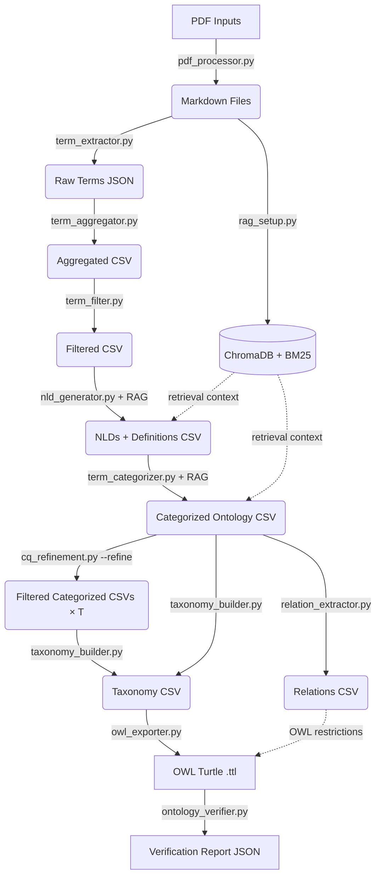

# System Context & Architecture

## Overview
This pipeline allows geoscientists to extract, define, and classify terminology from unstructured PDF documents, producing a formal OWL ontology anchored to published upper ontologies (BFO, GeoCore, GeoReservoir). It follows a 7-step sequential pipeline. Each step reads from `output/` (or `inputs/`) and writes to `output/`.

## Architecture



## Theoretical Grounding

The core contribution of this pipeline — using Natural Language Definitions (NLDs) to classify domain entities into upper ontology concepts — is grounded in:

> Lopes Junior, A.G. (2024) *"Automatic Classification of Domain Entities into Top-Level Ontology Concepts Using Natural Language Definitions"* (PhD thesis, PPGC/UFRGS)

Key validated findings that justify our design choices:

- **NLDs outperform all other textual representations** (term-alone, raw definition, example sentences) for classifying entities into BFO and DOLCE-Lite-Plus concepts, achieving >90% macro-F1 in best-case conditions.
- **Aristotelian form ("X is a Y that Z")** produces tighter semantic embedding clusters than free-form text, reducing polysemy and explicitly anchoring the proximate genus (Y) — the same genus used to name intermediate taxonomy nodes.
- The thesis used pre-existing human-curated NLDs from OBO Foundry and BabelNet. **This pipeline extends the approach** by RAG-augmenting an LLM to *generate* domain-specific NLDs from the Pre-Salt petroleum geology literature, then using those NLDs for classification.

**Ablation study mapping to thesis findings:**

| This pipeline | Thesis Study Case 1 |
|---|---|
| Condition A vs C (NLD contribution) | NLD > definiendum (term-alone) |
| Condition A vs B (RAG contribution) | Domain-specific NLD > generic NLD |
| Condition A vs D (NLD structuring) | Structured Aristotelian NLD > raw context |

---

## Competency Questions

The ontology scope is defined by 10 competency questions (CQs) that specify what the ontology must be able to answer. These guide both the iterative refinement process and the final evaluation. The canonical list lives in `resources/competency_questions.txt`.

| ID | Question |
|---|---|
| CQ1 | What are the geological objects of the Pre-Salt domain? |
| CQ2 | What earth materials constitute the Pre-Salt geological objects? |
| CQ3 | What geological structures occur in the Pre-Salt geological objects? |
| CQ4 | What post-depositional processes and structures occur in the Pre-Salt geological objects? |
| CQ5 | What are the spatial relations and arrangements in the Pre-Salt domain? |
| CQ6 | What are the dimensions and positions of the Pre-Salt geological objects? |
| CQ7 | What types of boundaries exist and where are they in the Pre-Salt geological objects? |
| CQ8 | What deposits and stratigraphic units are associated with Pre-Salt reservoirs? |
| CQ9 | What are the petrophysical characteristics of Pre-Salt reservoirs? |
| CQ10 | What geological age is associated with the Pre-Salt reservoir intervals? |

---

## Module Responsibilities

### `src/utils/pdf_processor.py` — Step 0: Ingestion
- **Tech**: `pymupdf4llm`
- Converts binary PDFs into clean Markdown, preserving headers and structure.
- Output: `inputs/*.md`

### `src/utils/rag_setup.py` — Step R: RAG Infrastructure
- **Tech**: BGE-M3 dense embeddings (ChromaDB), BM25 sparse retrieval, BGE-Reranker-v2-m3 cross-encoder
- Hybrid retrieval: BM25 (k=20) + ChromaDB (k=20) fused with Reciprocal Rank Fusion (RRF, k=60), then cross-encoder reranks top-20 down to top-5.
- Text splitter: `RecursiveCharacterTextSplitter` with `chunk_size=1024` **characters** (not tokens), `chunk_overlap=100`.
- ChromaDB is cached to `chroma_db_{chunk_size}/` (e.g., `chroma_db_1024/`) on first run. BM25 is always rebuilt in-memory.
- Provides retrieval context to Steps 4 (NLD generation) and 5 (categorization).

### `src/modules/term_extractor.py` — Step 1: Extraction
- **Tech**: Gemini 2.5 Pro (default; configurable via `LLM_EXTRACTION_MODEL`)
- Reads Markdown files and extracts candidate geological terms via a structured LLM prompt.
- Output: `output/1_raw_llm_extraction.json`

### `src/modules/term_aggregator.py` — Step 2: Aggregation
- **Tech**: spaCy lemmatization
- Deduplicates and counts term occurrences across all documents using lemmatization.
- Output: `output/2_aggregated_counts.csv`

### `src/modules/term_filter.py` — Step 3: Quality Control
- Applies a minimum document-frequency threshold (`MINIMUM_FREQUENCY_FILTER`, default 7). Since the LLM extracts each term at most once per paper, Frequency equals the number of distinct papers mentioning that term (document frequency). A threshold of 7 for an 82-paper corpus (~8.5%) retains terms that reflect cross-author consensus while excluding idiosyncratic or peripheral terminology.
- **Threshold rationale:** The threshold was selected after examining the frequency distribution of the 82-paper corpus: freq≥5 yielded 976 terms (including excessive generic and peripheral entries), freq≥7 yielded 614 well-focused domain terms, and freq≥10 yielded 368 terms (excluding legitimate concepts with narrower but significant coverage). The choice of freq≥7 balances coverage against noise and is consistent with standard terminology extraction practice. Downstream quality filters (NOT_CLASSIFIED removal at Step 5, cycle detection at Step 6) provide additional robustness, so the threshold does not need to be perfect — it needs to be reasonable.
- Output: `output/3_filtered_top_terms.csv`

### `src/modules/nld_generator.py` — Step 4: Definition Generation
- **Tech**: Gemini 2.5 Pro + RAG retrieval
- For each filtered term, retrieves the top-5 most relevant corpus chunks via hybrid search.
- Generates an Aristotelian NLD ("X is a Y that Z") grounded in the retrieved context.
- Few-shot examples and an English-language/polysemy instruction are included in the system prompt.
- **Robustness:** Required environment variables (`FILTERED_TERMS_OUTPUT`, `CONSOLIDATED_LLM_RESULTS_WITH_NLDS`, `OUTPUT_FAILURE_FILE`) are validated at startup with clear error messages. JSON parse failures set `Context_Used = false` (boolean) rather than a string sentinel. All CSV reads use `utf-8-sig` encoding for BOM-safe interoperability.
- Output: `output/4_nld_generated_definitions.csv`

### `src/modules/term_categorizer.py` — Step 5: Ontology Classification
- **Tech**: Gemini 2.5 Pro + RAG retrieval
- Classifies each term+NLD into one of three upper ontology namespaces using a waterfall:
  1. **GeoReservoir** (domain-specific petroleum geology)
  2. **GeoCore** (general geological science)
  3. **BFO** (Basic Formal Ontology — abstract/process/quality)
  4. **NOT_CLASSIFIED** (fallback for instruments or out-of-scope terms)
- Waterfall priority ensures each term maps to the most domain-specific applicable namespace: petroleum-specific terms to GeoReservoir first, general geological terms to GeoCore, and foundational abstractions to BFO.
- Output: `output/5_categorized_ontology.csv`

### `src/modules/cq_refinement.py` — Step 5b: CQ-Driven Refinement
- **Tech**: Gemini 2.5 Pro (synonym triage + CQ scoring)
- Activated by `--refine` flag. Runs after Step 5 and before Steps 6-7b.
- **Sub-step A — Deterministic cleanup:** Detects encoding/accent duplicates (Unicode NFKD normalisation) and hyphenation variants (build-up/buildup). Merges to the longer/accented canonical form.
- **Sub-step B — Synonym triage:** Groups terms sharing a head noun within the same category (≥50% word overlap). Sends clusters to the LLM for 3-way classification: SYNONYM (merge to canonical), SPECIALIZATION (keep both + emit parent-child hint), or DISTINCT (keep both). NLDs are included so the LLM judges meaning, not just surface form. SPECIALIZATION pairs are written to `5b_specialization_hints.csv` and passed to the taxonomy builder as parent-child constraints.
- **Sub-step C — CQ scoring:** Each surviving term is scored against 10 competency questions in parallel batches of 5 (`CQ_BATCH_SIZE`). The LLM returns which CQs the term meaningfully contributes to. Checkpoint/resume via `5b_cq_matrix.csv`.
- **Sub-step D — Threshold split:** Writes filtered categorized CSVs at T=0 (cleanup only), T≥1, T≥2, T≥3 into `output/refined/t{N}/5_categorized_ontology.csv`.
- **Robustness:** CQ identifiers are validated against a fixed set (CQ1-CQ10). Batch size mismatches raise `ValueError`. JSON parse failures are logged and skipped. ThreadPoolExecutor parallelism is configurable via `MAX_CONCURRENT_CQ`.
- Output: `output/refined/5b_cleanup_report.csv`, `output/refined/5b_cq_matrix.csv`, `output/refined/5b_specialization_hints.csv`, `output/refined/threshold_summary.csv`, per-threshold CSVs.

### `src/modules/taxonomy_builder.py` — Step 6: Taxonomy Construction
- **Tech**: Gemini 2.5 Pro
- Builds a hierarchical taxonomy per ontology group (GeoReservoir, GeoCore, BFO) using NLDs for naming.
- Accepts optional `hints_csv` parameter with pre-identified SPECIALIZATION pairs from Step 5b. When provided, these are injected into the prompt as parent-child constraints.
- Processes terms in chunks of up to 150 per LLM call to avoid cross-chunk inconsistency.
- **Cycle detection:** After each LLM response, parent-chain walks detect any cycles (A→B→A). Cyclic terms are re-parented to the category root with a warning log.
- Prompt anchors intermediate node names to canonical UPPER_IRIS vocabulary (55 published IRIs from BFO/GeoCore/GeoReservoir), and instructs the LLM to use the Aristotelian genus from NLDs ("X is a Y that Z" → use Y as intermediate node name).
- **UPPER_IRIS invariant**: every entry must map to a unique published IRI. A module-level assertion raises `RuntimeError` if a duplicate is detected, because aliases would corrupt the OWL exporter's label map and overwrite canonical `rdfs:label` values in the final ontology.
- **Class vs. individual distinction is resolved here:** named geological time periods (Aptian, Cretaceous), petroleum fields (Lula Field, Búzios), basins (Santos Basin), and formations are assigned `rdf:type` (OWL individuals); generic types/kinds (Grainstone, Fault, Porosity) are assigned `rdfs:subClassOf` (OWL classes).
- NLDs are carried forward into the output CSV as a column for OWL annotation.
- Output: `output/6_taxonomy.csv`

### `src/modules/relation_extractor.py` — Step 6b: Relation Extraction
- **Tech**: Gemini 2.5 Pro + `relation_validator.py`
- Extracts ontological relations from NLDs using 16 Tier 1 BFO/RO properties (has_part, part_of, has_participant, participates_in, occurs_in, located_in, derives_from, derives_into, generated_by, constituted_by, has_quality, inheres_in, preceded_by, precedes, generated_in, has_age).
- Processes terms in batches of 10 (configurable via `RELATION_BATCH_SIZE`).
- 3 few-shot examples guide extraction; confidence threshold filters weak relations (≥0.7).
- Post-hoc property specialisation: generic `has_part`/`part_of` upgraded to BFO-precise `has_continuant_part`/`has_occurrent_part` based on subject/filler metatypes.
- Filler source resolution: deterministic Python-side tagging (`domain_term` vs `external`).
- **Robustness:** Checkpoint/resume with single flat CSV. Batch size mismatch raises `ValueError`. Unknown properties are rejected.
- Output: `output/6b_relations.csv`

### `src/modules/ontology_critic.py` — Step 6c: Ontology Critic
- **Tech**: Gemini 2.5 Pro (3-pass LLM review)
- Post-processing quality pass that reviews the taxonomy for redundancy, misplacements, and vague terms.
- **Pass 1 — Intra-category:** Reviews each category branch independently. Actions: MERGE (near-duplicates), MOVE (misplaced siblings), REMOVE (vague/abstract terms), RENAME (ambiguous names).
- **Pass 2 — Cross-category:** Reviews all non-intermediate terms across categories. Actions: CROSS_MERGE (duplicate concepts in different categories), CROSS_MOVE (miscategorised terms).
- **Pass 3 — Essentiality:** Final quality gate asking which remaining terms do not earn their place in a lean domain ontology.
- After all passes, orphaned intermediate nodes (no children remaining) are removed, and broken parent references (removed parents) are repaired by re-parenting to the term's Category.
- Relations CSV is also cleaned: renames and merges propagate to Term/Filler columns; removed terms' relations are dropped on **both** sides (Term and Filler), so a restriction whose filler was just removed from the taxonomy cannot survive and produce a phantom orphan class under `owl:Thing`.
- **Robustness:** Structured `_target` metadata in log rows avoids fragile string parsing. Category validation ensures REMOVE reparenting only uses valid parents.
- Output: `output/6c_taxonomy_cleaned.csv`, `output/6c_critic_log.csv`, `output/6c_relations_cleaned.csv`

### `src/modules/relation_reclassifier.py` — Step 6d: Relation-Based Reclassification
- **Tech**: Deterministic Python (no LLM)
- Post-processing step that uses accepted relations from Step 6b to infer and correct BFO metatype classifications.
- Reverses the domain/range validation logic from `relation_validator.py`: instead of "is this relation valid for these categories?" → "given these relations, what categories are valid?"
- For each term, collects all ACCEPTED relations where it appears as subject (→ accumulates property domain constraints) or filler (→ accumulates property range constraints).
- Intersects all metatype evidence; if intersection is empty → flags as CONTRADICTION for human review.
- Finds the most specific compatible category from `_CATEGORY_TO_METATYPES`. If current category is less specific or incompatible → reclassifies.
- After reclassification, checks Parent_Term compatibility with new category and reparents to upper-ontology root if incompatible.
- **Fully dynamic:** zero hardcoded inference rules. All property constraints, category definitions, and the operating mode are read from `ontology_config.yaml` via `src/utils/ontology_config.py`.
- **Two operating modes** (selected by `STEP6D_MODE` env var or `step6d.mode` in YAML):
  - `refinement` *(default, conservative)*: emits **REFINE** actions only. Candidate categories must be strict BFO subclasses of the current category (proper-superset of metatype chain) and must not introduce non-generic metatypes absent from the evidence. Terms with fewer than `step6d.refinement_min_evidence` (default `2`) accepted relations are skipped. Contradictions are logged but never acted on. Terms whose current category is not in the YAML (e.g., AI-invented labels) are skipped — the strict-subclass invariant cannot be verified, so the term is left as-is rather than risk an unsafe move.
  - `contradiction` *(legacy, aggressive)*: emits **RECLASSIFY** actions whenever the evidence intersection points to a different more-specific category, even across unrelated branches. No min-evidence gate; no strict-subclass requirement.
- **Disjoint-contradiction detection:** Implied metatype sets are scanned against the 5 BFO 2020 disjoint pairs (`Continuant`⊥`Occurrent`, `MaterialEntity`⊥`ImmaterialEntity`, etc.). Sets containing both members of a pair are logged as CONTRADICTION (the relations cannot all be true of one individual) and the term is left in place under both modes.
- **Robustness:** Never downgrades to a less specific category. Prefers domain-specific categories (GeoCore/GeoReservoir) over raw BFO. Refinement mode is the strict default; the contradiction mode is retained only for differential study.
- Output: `output/6d_taxonomy_reclassified.csv`, `output/6d_reclassification_log.csv` (Action ∈ {REFINE, RECLASSIFY, CONTRADICTION, REPARENT}).

### `src/modules/owl_exporter.py` — Step 7: OWL Export
- **Tech**: `rdflib`
- Converts the taxonomy CSV to a Protege-compatible OWL Turtle file.
- `owl:Class` entries get `rdfs:label`, `rdfs:comment` (NLD, from the taxonomy CSV NLD column), and `rdfs:subClassOf` triples pointing to published BFO/GeoCore/GeoReservoir IRIs.
- `owl:NamedIndividual` entries (named fields, basins, formations, time periods) get `rdf:type` triples pointing to their parent class.
- Intermediate (synthesised) nodes get `rdfs:label` only (no NLD comment).
- Accepted relations from Step 6b are encoded as `owl:Restriction` blank nodes (`owl:onProperty` + `owl:someValuesFrom`), adding existential axioms to domain classes.
- **Upper-ontology backbone:** Parses reference OWL files (`bfo-core.owl`, `geocore-full.owl`, `geores-full.owl`) and walks parent chains to add `rdfs:subClassOf` triples anchoring GeoCore/GeoReservoir classes to their BFO roots, plus `rdfs:label` annotations for all intermediate upper-level IRIs.
- The ontology header declares `owl:imports <http://purl.obolibrary.org/obo/bfo.owl>`.
- **Disjointness conflict detection & auto-repair:** After building the upper-ontology backbone, detects presalt: classes that inherit from both sides of a BFO disjoint pair (e.g., MaterialEntity ⊥ ImmaterialEntity). Uses the term's Category from the taxonomy to determine which parent lineage to keep and removes the conflicting `rdfs:subClassOf` edge. Runs up to 3 repair passes to handle cascading conflicts. Each repair is logged as a warning. BFO disjointness axioms are always added to the ontology.
- **Why post-hoc repair rather than prevention?** The taxonomy builder (Step 6) uses an LLM to arrange terms into IS-A hierarchies within each category. The LLM assigns each term exactly one parent, but may create intermediate classes (e.g., "Geological Depression") to bridge the gap between a domain term and its category root. These intermediates are driven by geological reasoning — the LLM sees that a basin is a type of depression, and a depression is a spatial feature. However, the LLM has no awareness of BFO's formal disjointness axioms (e.g., MaterialEntity ⊥ ImmaterialEntity). When the OWL exporter adds the upper-ontology backbone (published GeoCore/BFO parent chains), an intermediate like "Geological Depression" may transitively inherit from the wrong BFO branch, creating a formal inconsistency that the LLM's geological reasoning cannot anticipate. Post-hoc repair is the correct design because: (1) **prevention is fragile** — instructing the LLM about formal disjointness constraints does not guarantee compliance, since natural-language geological reasoning and formal ontology reasoning are fundamentally different tasks; (2) **the repair is deterministic and principled** — it uses the Category from Step 5 as ground truth to identify which BFO branch each term belongs to, and removes only the edges that lead toward the wrong branch; (3) **the problem is rare** — in the 10-paper production run (2,482 triples), only 2 edges required repair (0.08%), both involving SedimentaryBasin's intermediate ancestor crossing from MaterialEntity to ImmaterialEntity. This architecture separates concerns cleanly: the LLM optimises for geological plausibility, while deterministic post-processing enforces formal ontological consistency.
- **Robustness guards:**
  - IRI generation normalises terms to lowercase before CamelCase conversion, preventing case-collision duplicates (e.g., "Carbonate Mineral" and "carbonate mineral" map to the same IRI).
  - UPPER_IRIS lookup is case-insensitive, so BFO/GeoCore/GeoReservoir terms are matched regardless of capitalisation.
  - **OWL-sourced labels are canonical**: `rdfs:label` values are taken from the published OWL files (`bfo-core.owl`, `geocore-full.owl`, `geores-full.owl`) and only fall back to UPPER_IRIS friendly names when an OWL has no label for an IRI. This prevents UPPER_IRIS aliases from overwriting the published label.
  - **Phantom filler guard**: if a relation's Filler is neither a known taxonomy term nor an upper-ontology IRI, the restriction is skipped and a warning is logged with the offending `term --[prop]--> filler` triples. This is a backstop for cases the critic should have handled.
  - Self-referential `rdfs:subClassOf` triples (term IRI = parent IRI) are detected and suppressed.
  - Upper→upper triple suppression: triples where both subject and object resolve to upper-level IRIs (BFO/GeoCore/GeoReservoir) are skipped. Only triples where at least one side is a presalt: entity are emitted — the pipeline does not alter published upper ontologies.
- Output: `output/7_ontology.ttl`

#### Axiom Coverage
The pipeline generates the following OWL axiom types:
- **SubClassOf axioms** (from Step 6 taxonomy): class hierarchy triples, e.g., `Grainstone rdfs:subClassOf SedimentaryRock`.
- **Existential restrictions** (from Step 6b relations): `owl:someValuesFrom` restrictions on object properties, e.g., `Dolomitization rdfs:subClassOf (has_participant some Calcite)`.
- **Type assertions** (from Step 6 taxonomy): named individuals get `rdf:type` triples, e.g., `SantosBasin rdf:type SedimentaryBasin`.
- **Disjointness axioms**: BFO-level `owl:disjointWith` triples between top-level categories.
- **Upper-ontology backbone**: `rdfs:subClassOf` chains linking GeoCore/GeoReservoir intermediate classes up to their BFO roots.

The following axiom types are **not generated** and are left for future work:
- **Cardinality restrictions** (`owl:minCardinality`, `owl:maxCardinality`): require domain expert curation not feasible from NLDs alone.
- **Equivalence axioms** (`owl:equivalentClass`): necessary-and-sufficient conditions carry high risk of incorrect ontological commitment when generated automatically.
- **Universal restrictions** (`owl:allValuesFrom`): "only" constraints are rarely extractable from natural language text.
- **Closure axioms**: depend on universal restrictions and complete domain knowledge.

The combination of taxonomy axioms and existential restrictions is the standard output level for ontology learning systems. More expressive axioms require manual ontological commitment beyond what automated NLD analysis can provide.

### `src/modules/ontology_verifier.py` — Step 7b: Ontology Verification
- **Tech**: `rdflib`, OOPS! REST API (optional), HermiT reasoner via owlready2 (optional)
- Post-export verification of the OWL artifact. No LLM repair — verification-only.
- **Layer 1 — Syntax**: Parses the Turtle file with RDFLib; reports parse errors with diagnostics.
- **Layer 2 — Structure**: Checks for self-referential `rdfs:subClassOf`, orphan classes (no parent), missing `rdfs:label`, missing `rdfs:comment` (NLD not propagated), and upper-ontology anchoring (BFO/GeoCore/GeoReservoir IRI count).
- **Layer 3 — OOPS! Pitfalls** (optional): Calls the OOPS! REST API if `OOPS_URL` env var is configured. Works with the remote API (`https://oops.linkeddata.es/rest`), a local Docker instance (`docker run -p 8080:8080 mpovedavillalon/oops:v1`), or any compatible endpoint.
- **Layer 4 — HermiT Reasoner Consistency** (optional): Invokes the HermiT reasoner via owlready2 to check ontology consistency. Converts Turtle → NTriples via rdflib for cross-platform compatibility. Reports PASS/FAIL with list of unsatisfiable classes. Requires Java (Eclipse Temurin JDK 21) and owlready2. Java path controlled by `JAVA_EXE` env var. Skippable with `--skip-reasoner` CLI flag.
- Issues are classified by severity: CRITICAL, IMPORTANT, MINOR.
- **Robustness:** Docker absence, container startup failures, API errors, missing Java, and HermiT invocation errors are caught and reported as warnings, never crashing the pipeline.
- Output: `output/7b_verification_report.json`

---

## Configuration — `ontology_config.yaml`

The single source of truth for upper-ontology metadata, BFO disjoint pairs, relation property constraints, and Step 6d behaviour. Loaded once at import time by `src/utils/ontology_config.py` (frozen dataclass + `lru_cache`-backed singleton). All modules read from `get_config()`; nothing else is hardcoded.

### Top-level keys
- `project`: `namespace`, `prefix`, `version`, BFO `import_iri`
- `step6d`: Step 6d mode and guardrails — see below
- `provenance_tiers_active`: ordered list of relation provenance tiers to honour (default: all four)
- `ontologies`: per-ontology block (`bfo`, `geocore`, `georeservoir`, `ro`) with `namespace`, `prefix`, `owl` (file path), `import_iri`, `eval_tier`, and a `classes:` list (each class with `iri`, `label`, `metatypes`, `llm_definition`, optional `disjoint_pairs`)
- `verifier_prefixes`: maps `bfo`, `geo`, `presalt` → URI prefixes used by `ontology_verifier.py`
- `metatype_groups`: 18 named groups (`CONTINUANT`, `OCCURRENT`, `MATERIAL`, `PROCESS`, …) that expand recursively to flat sets of literal BFO metatype labels — used as shorthand in `relations` `domain`/`range` lists
- `relations`: 71 property constraints (RO + BFO 2020 + GeoCore/GeoReservoir authored + project-specific tightenings). Each entry has `iri`, `domain` (list of group names or literal metatype strings), `range`, `inverse`, `provenance`, `notes`

### Provenance tiers
Each relation in `relations:` declares its `provenance`:
- `owl_axiom` — declared in a local OWL file (`bfo-core.owl`, `geocore-full.owl`, `geores-full.owl`)
- `bfo_shape_axiom` — from BFO 2020 specification documents only
- `ro_release` — from the Relation Ontology core release (`resources/ro-core.owl`)
- `spec_curation` — project-specific tightening of a domain/range beyond what the source ontology asserts

Set `RELATION_PROVENANCE_TIERS=owl_axiom,bfo_shape_axiom` (comma-separated, validated against the 4-tier set) to disable RO and project-curated relations at runtime. The validator and Step 6d both honour the active tier set.

The audit script `python -m src.evaluation.property_constraints_audit` writes `output/property_constraints_audit.csv` listing every relation with its provenance and current active/inactive status.

### Step 6d configuration
```yaml
step6d:
  mode: refinement                 # refinement | contradiction
  refinement_min_evidence: 2       # min # accepted relations to trigger REFINE
  refinement_only_to_strict_subclass: true
```
- `STEP6D_MODE` env var overrides `mode` (validated against `{refinement, contradiction}`)
- See the Step 6d module description above for the semantics of each mode

### Loader API (selected)
- `get_config() → OntologyConfig` — cached singleton; `reload_config()` re-reads YAML (used in tests)
- `cfg.upper_iris()`, `cfg.category_to_metatypes()`, `cfg.categories_for(ontology)` — for taxonomy/category lookups
- `cfg.llm_definitions_block(ontology)` — flat newline-separated `Label: definition` text passed to LLM prompts (replaces the deleted `resources/*-definitions.txt` files)
- `cfg.owl_class_paths()` vs `cfg.owl_file_paths()` — class-source OWL files (3) vs all OWL files including property-only ones like `ro-core.owl` (4)
- `cfg.bfo_disjoint_pairs()` — list of IRI pairs for `owl:disjointWith` axioms
- `cfg.property_constraints(tier_filter=None)` — dict of `{name: PropertyConstraint}` filtered to the active provenance tiers (default = `cfg.active_provenance_tiers()`)
- `cfg.all_relations()` — every relation including inactive ones (for the audit script)
- `cfg.metatype_groups` — pre-expanded literal frozensets
- `cfg.step6d_mode()`, `cfg.step6d_min_evidence()`, `cfg.step6d_strict_subclass()`

### Environment overrides
| Variable | Default | Effect |
|---|---|---|
| `ONTOLOGY_CONFIG_PATH` | `./ontology_config.yaml` | Path to YAML file (lets tests point at fixtures) |
| `STEP6D_MODE` | from YAML | `refinement` or `contradiction` |
| `RELATION_PROVENANCE_TIERS` | from YAML (all four) | Comma-separated subset of `{owl_axiom, bfo_shape_axiom, ro_release, spec_curation}` |

### Parity test
`test/test_ontology_config_parity.py` runs 24 checks asserting the YAML produces literals identical to the values modules previously hardcoded, plus Phase 4 sanity checks (default mode, evidence threshold, strict-subclass logic, env-override round-trip). Must pass after any YAML or loader change.

---

## Domain Profile — `domains/<name>/domain_profile.yaml`

A second YAML alongside `ontology_config.yaml` that decouples **domain-specific text** (expert personas, evaluation labels, calibration examples) from prompt templates and the expert workbook. The goal: retarget the pipeline to a new scientific domain by swapping a single YAML, without editing module code.

Loaded by `src/utils/domain_profile.py` (frozen dataclass + `lru_cache` singleton, same pattern as `ontology_config.py`). Default path: `domains/presalt/domain_profile.yaml`; override with `DOMAIN_PROFILE_PATH`.

### Top-level keys
- `name`: long domain name (e.g. `"Brazilian Pre-Salt petroleum geology"`) — available as `<<name>>` in prompts
- `short_name`: short label (e.g. `"Pre-Salt"`) — available as `<<short_name>>` in prompts
- `personas`: dict keyed by prompt filename without `.txt`. Each value is the descriptive fragment used by the `<<persona>>` placeholder, which prompt templates wrap as `You are <<persona>>.` 11 prompts currently consume this: term extraction, NLD generation, term/ablation categorization, CQ scoring, CQ synonym triage, ontology critic (3 passes), relation extraction, taxonomy building
- `evaluation_workbook.instruction_rows`: list of `[section, details]` pairs rendered verbatim as Sheet 1 of the expert evaluation workbook (Likert anchors, calibration examples, project title). 49 rows in the Pre-Salt profile

### Loader API
- `get_profile() → DomainProfile` — cached singleton
- `profile.persona(prompt_key)` — returns persona text; raises `KeyError` if missing (fail fast — prompts referencing `<<persona>>` cannot render with an empty string)
- `profile.instruction_rows` — tuple of `(section, details)` pairs; consumed by `expert_eval_generator.build_instructions_sheet()`

### Prompt interpolation
`src/utils/prompt_loader.py` runs each loaded prompt file through `_interpolate()` which substitutes `<<persona>>`, `<<name>>`, `<<short_name>>` from the active profile. Unknown placeholders raise `KeyError`. The regression test `test/diff_prompts.py` snapshots all rendered prompts and must remain byte-equal after any profile change (22 prompt parts × byte-identical).

### Adding a new domain
1. Create `domains/<your_domain>/domain_profile.yaml` matching the Pre-Salt structure
2. Provide a persona for every prompt filename in `prompts/`
3. Provide all 49 `instruction_rows` (Likert anchors + calibration examples for your domain)
4. Set `DOMAIN_PROFILE_PATH=domains/<your_domain>/domain_profile.yaml`
5. Also swap `ONTOLOGY_CONFIG_PATH` if your upper ontologies differ from BFO/GeoCore/GeoReservoir

---

## Directory Structure

```
ontology_config.yaml      # Single source of truth (upper ontologies, relations, Step 6d config)
domains/
  presalt/
    domain_profile.yaml   # Domain-specific text: personas, workbook instruction rows
pipeline.py               # Orchestrator + CLI (thin: _build_parser, _dispatch_subcommand, _run_refinement_pipeline, _clean_outputs, _check_stop helpers)
src/
  modules/                # Steps 1-7 (extraction → OWL export)
  utils/                  # ontology_config loader, domain_profile loader, csv_io (utf-8-sig wrappers), checkpoint (resumable I/O), RAG setup, PDF conversion, logging, Gemini client, relation validator, prompt loader (with <<persona>> interpolation)
  evaluation/             # Ablation study, Layer 1 & 2 analysis, expert eval, property-constraints audit
prompts/                  # LLM prompt files (system instructions + templates with <<persona>> placeholders)
inputs/                   # Source PDFs + generated .md files
output/                   # Step outputs (1_raw → 7_ontology.ttl)
  ablation/               # Condition-specific CSVs (cat_A.csv … cat_D.csv)
  refined/                # CQ-driven refinement outputs (--refine)
    5b_cleanup_report.csv # Encoding/synonym merges
    5b_cq_matrix.csv      # Per-term CQ scoring matrix
    t0/ t1/ t2/ t3/       # Per-threshold pipeline outputs (Steps 5-7b)
  property_constraints_audit.csv  # Generated by src.evaluation.property_constraints_audit
resources/                # Reference OWL files: bfo-core.owl, geocore-full.owl, geores-full.owl, ro-core.owl
chroma_db_1024/           # Cached ChromaDB vector index (created on first run)
test/                     # E2E test runner + parity, prompt-diff, instructions-diff fixtures
  test_ontology_config_parity.py  # 24 checks — must pass after any YAML/loader change
  diff_prompts.py                 # 22 rendered prompts must stay byte-equal to baseline
  diff_instructions_sheet.py      # 49 workbook instruction rows must stay byte-equal to baseline
  regression_t1.py                # Deterministic 6d→7→7b regression (329 classes / 26 individuals / 3350 triples / 39 upper IRIs)
```

---

## Evaluation Architecture

The pipeline supports a two-layer evaluation framework for thesis validation:

- **Layer 1** (`layer1_analysis.py`): Fully automated. Computes cross-condition agreement matrices, Cochran's Q significance tests, category migration patterns, and NOT_CLASSIFIED rates across all 4 ablation conditions.
- **Layer 2** (`expert_eval_generator.py` + `expert_eval_analyzer.py`): Expert-in-the-loop. Generates a blinded **5-sheet** Excel workbook for 3 domain experts to evaluate **200 terms**:
  - **Term Relevance** (1-5 Likert)
  - **NLD Quality** (blinded A vs B, 1-5 + preference)
  - **Category Correctness** (stratified by ontology tier — GeoReservoir with full descriptions, GeoCore/BFO simplified)
  - **Taxonomy Correctness** (~80 parent-child IS-A pairs, stratified by category). Selection: only IS-A edges (`rdfs:subClassOf` / `rdf:type`); ~75 % from edges involving the selected terms (equal samples per category), ~25 % from intermediate-node edges for hierarchy-depth coverage; trimmed to 80, shuffled with seed=42.
  - Results analysed with Wilcoxon signed-rank (gated by Friedman omnibus significance), ICC, Fleiss' kappa. Taxonomy analysis includes per-category accuracy and inter-rater agreement.
- **CQ filter validation** (combined mode via `--expert-eval --refine --threshold T`): Generates a combined workbook sampling ~150 kept + ~50 removed terms (blinded). Expert relevance scores are analysed with Mann-Whitney U (kept vs removed) to validate that the CQ filter preferentially retains relevant terms. Blinding key includes `CQ_Status` and `CQ_Count` columns.
