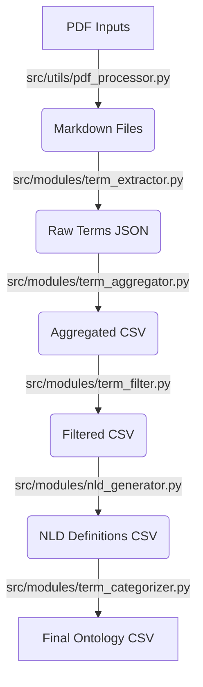

# System Context & Architecture

## Overview
This pipeline allows geoscientists to extract, define, and classify terminology from unstructured PDF documents. It transforms raw text into a structured ontology (CSV) suitable for Knowledge Graphs.

## Architecture

The system follows a sequential 5-stage pipeline pattern. Each stage reads from `output/` (or `inputs/`) and writes to `output/`.

## Module Responsibilities

### 1. `src/utils/pdf_processor.py`
*   **Role**: Ingestion.
*   **Tech**: PyMuPDF via `pymupdf4llm`.
*   **Function**: Converts binary PDFs into clean Markdown, preserving headers and structure for the RAG system.

### 2. `src/modules/term_extractor.py`
*   **Role**: Extraction.
*   **Tech**: Gemini 2.5 Flash.
*   **Function**: Reads Markdown files and extracts potential geological terms based on a strict prompt.

### 3. `src/modules/term_filter.py`
*   **Role**: Quality Control.
*   **Function**: Filters terms based on frequency (default > 1) and removes stop words or noise.

### 4. `src/modules/nld_generator.py`
*   **Role**: Definition Generation (RAG).
*   **Tech**: LangChain + ChromaDB + Gemini.
*   **Context Awareness**:
    *   It retrieves relevant chunks from the source PDFs using Hybrid Search (BM25 + Vector).
    *   It generates an Aristotelian definition ("X is a Y that Z") using this context.
    *   **Crucial Note**: The context provided here is for audit purposes and generating the specific definition.

### 5. `src/modules/term_categorizer.py`
*   **Role**: Ontology Classification.
*   **Function**: Reads the generated NLDs and classifies each term into top-level ontologies:
    *   **GeoReservoir**: Domain-specific categories.
    *   **GeoCore**: General geological concepts.
    *   **BFO**: Basic Formal Ontology (abstract).

## Directory Structure
*   `src/modules`: Business logic for each step.
*   `src/utils`: Reusable components (RAG setup, PDF conversion).
*   `resources/`: Text files containing the ontology definitions used for prompting the Categorizer.
*   `chroma_db/`: Persistent Vector Database storage.
*   `test/`: E2E test suite (isolated environment).
