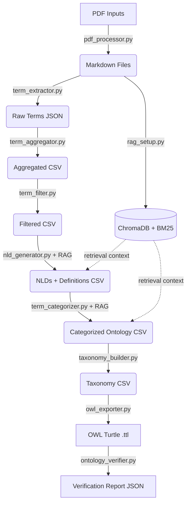

# System Context & Architecture

## Overview
This pipeline allows geoscientists to extract, define, and classify terminology from unstructured PDF documents, producing a formal OWL ontology anchored to published upper ontologies (BFO, GeoCore, GeoReservoir). It follows a 7-step sequential pipeline. Each step reads from `output/` (or `inputs/`) and writes to `output/`.

## Architecture



## Theoretical Grounding

The core contribution of this pipeline — using Natural Language Definitions (NLDs) to classify domain entities into upper ontology concepts — is grounded in:

> Lopes Junior, A.G. (2024) *"Automatic Classification of Domain Entities into Top-Level Ontology Concepts Using Natural Language Definitions"* (PhD thesis, PPGC/UFRGS)

Key validated findings that justify our design choices:

- **NLDs outperform all other textual representations** (term-alone, raw definition, example sentences) for classifying entities into BFO and DOLCE-Lite-Plus concepts, achieving >90% macro-F1 in best-case conditions.
- **Aristotelian form ("X is a Y that Z")** produces tighter semantic embedding clusters than free-form text, reducing polysemy and explicitly anchoring the proximate genus (Y) — the same genus used to name intermediate taxonomy nodes.
- The thesis used pre-existing human-curated NLDs from OBO Foundry and BabelNet. **This pipeline extends the approach** by RAG-augmenting an LLM to *generate* domain-specific NLDs from the Pre-Salt petroleum geology literature, then using those NLDs for classification.

**Ablation study mapping to thesis findings:**

| This pipeline | Thesis Study Case 1 |
|---|---|
| Condition A vs C (NLD contribution) | NLD > definiendum (term-alone) |
| Condition A vs B (RAG contribution) | Domain-specific NLD > generic NLD |
| Condition A vs D (NLD structuring) | Structured Aristotelian NLD > raw context |

---

## Module Responsibilities

### `src/utils/pdf_processor.py` — Step 0: Ingestion
- **Tech**: `pymupdf4llm`
- Converts binary PDFs into clean Markdown, preserving headers and structure.
- Output: `inputs/*.md`

### `src/utils/rag_setup.py` — Step R: RAG Infrastructure
- **Tech**: BGE-M3 dense embeddings (ChromaDB), BM25 sparse retrieval, BGE-Reranker-v2-m3 cross-encoder
- Hybrid retrieval: BM25 (k=20) + ChromaDB (k=20) fused with Reciprocal Rank Fusion (RRF, k=60), then cross-encoder reranks top-20 down to top-5.
- Text splitter: `RecursiveCharacterTextSplitter` with `chunk_size=1024` **characters** (not tokens), `chunk_overlap=100`.
- ChromaDB is cached to `chroma_db_{chunk_size}/` (e.g., `chroma_db_1024/`) on first run. BM25 is always rebuilt in-memory.
- Provides retrieval context to Steps 4 (NLD generation) and 5 (categorization).

### `src/modules/term_extractor.py` — Step 1: Extraction
- **Tech**: Gemini 2.5 Pro (default; configurable via `LLM_EXTRACTION_MODEL`)
- Reads Markdown files and extracts candidate geological terms via a structured LLM prompt.
- Output: `output/1_raw_llm_extraction.json`

### `src/modules/term_aggregator.py` — Step 2: Aggregation
- **Tech**: spaCy lemmatization
- Deduplicates and counts term occurrences across all documents using lemmatization.
- Output: `output/2_aggregated_counts.csv`

### `src/modules/term_filter.py` — Step 3: Quality Control
- Applies a minimum frequency threshold (`MINIMUM_FREQUENCY_FILTER`, default: ≥ 3 source documents). For an 80-paper corpus, 3 = 3.75% cross-document consensus — a threshold consistent with Frantzi et al.'s C-value method and Kageura & Umino's terminology extraction conventions, which establish cross-document co-occurrence as the standard quality signal for domain terminology.
- No stopword list; frequency across documents is the only filter criterion.
- Output: `output/3_filtered_top_terms.csv`

### `src/modules/nld_generator.py` — Step 4: Definition Generation
- **Tech**: Gemini 2.5 Pro + RAG retrieval
- For each filtered term, retrieves the top-5 most relevant corpus chunks via hybrid search.
- Generates an Aristotelian NLD ("X is a Y that Z") grounded in the retrieved context.
- Few-shot examples and an English-language/polysemy instruction are included in the system prompt.
- **Robustness:** Required environment variables (`FILTERED_TERMS_OUTPUT`, `CONSOLIDATED_LLM_RESULTS_WITH_NLDS`, `OUTPUT_FAILURE_FILE`) are validated at startup with clear error messages. JSON parse failures set `Context_Used = false` (boolean) rather than a string sentinel. All CSV reads use `utf-8-sig` encoding for BOM-safe interoperability.
- Output: `output/4_nld_generated_definitions.csv`

### `src/modules/term_categorizer.py` — Step 5: Ontology Classification
- **Tech**: Gemini 2.5 Pro + RAG retrieval
- Classifies each term+NLD into one of three upper ontology namespaces using a waterfall:
  1. **GeoReservoir** (domain-specific petroleum geology)
  2. **GeoCore** (general geological science)
  3. **BFO** (Basic Formal Ontology — abstract/process/quality)
  4. **NOT_CLASSIFIED** (fallback for instruments or out-of-scope terms)
- Waterfall priority ensures each term maps to the most domain-specific applicable namespace: petroleum-specific terms to GeoReservoir first, general geological terms to GeoCore, and foundational abstractions to BFO.
- Output: `output/5_categorized_ontology.csv`

### `src/modules/taxonomy_builder.py` — Step 6: Taxonomy Construction
- **Tech**: Gemini 2.5 Pro
- Builds a hierarchical taxonomy per ontology group (GeoReservoir, GeoCore, BFO) using NLDs for naming.
- Processes terms in chunks of up to 150 per LLM call to avoid cross-chunk inconsistency.
- **Cycle detection:** After each LLM response, parent-chain walks detect any cycles (A→B→A). Cyclic terms are re-parented to the category root with a warning log.
- Prompt anchors intermediate node names to canonical UPPER_IRIS vocabulary (52 published IRIs from BFO/GeoCore/GeoReservoir), and instructs the LLM to use the Aristotelian genus from NLDs ("X is a Y that Z" → use Y as intermediate node name).
- **Class vs. individual distinction is resolved here:** named geological time periods (Aptian, Cretaceous), petroleum fields (Lula Field, Búzios), basins (Santos Basin), and formations are assigned `rdf:type` (OWL individuals); generic types/kinds (Grainstone, Fault, Porosity) are assigned `rdfs:subClassOf` (OWL classes).
- NLDs are carried forward into the output CSV as a column for OWL annotation.
- Output: `output/6_taxonomy.csv`

### `src/modules/owl_exporter.py` — Step 7: OWL Export
- **Tech**: `rdflib`
- Converts the taxonomy CSV to a Protege-compatible OWL Turtle file.
- `owl:Class` entries get `rdfs:label`, `rdfs:comment` (NLD, from the taxonomy CSV NLD column), and `rdfs:subClassOf` triples pointing to published BFO/GeoCore/GeoReservoir IRIs.
- `owl:NamedIndividual` entries (named fields, basins, formations, time periods) get `rdf:type` triples pointing to their parent class.
- Intermediate (synthesised) nodes get `rdfs:label` only (no NLD comment).
- The ontology header declares `owl:imports <http://purl.obolibrary.org/obo/bfo.owl>`.
- **Robustness guards:**
  - IRI generation normalises terms to lowercase before CamelCase conversion, preventing case-collision duplicates (e.g., "Carbonate Mineral" and "carbonate mineral" map to the same IRI).
  - UPPER_IRIS lookup is case-insensitive, so BFO/GeoCore/GeoReservoir terms are matched regardless of capitalisation.
  - Self-referential `rdfs:subClassOf` triples (term IRI = parent IRI) are detected and suppressed.
  - Upper→upper triple suppression: triples where both subject and object resolve to upper-level IRIs (BFO/GeoCore/GeoReservoir) are skipped. Only triples where at least one side is a presalt: entity are emitted — the pipeline does not alter published upper ontologies.
- Output: `output/7_ontology.ttl`

### `src/modules/ontology_verifier.py` — Step 7b: Ontology Verification
- **Tech**: `rdflib`, OOPS! REST API (optional)
- Post-export verification of the OWL artifact. No LLM repair — verification-only.
- **Layer 1 — Syntax**: Parses the Turtle file with RDFLib; reports parse errors with diagnostics.
- **Layer 2 — Structure**: Checks for self-referential `rdfs:subClassOf`, orphan classes (no parent), missing `rdfs:label`, missing `rdfs:comment` (NLD not propagated), and upper-ontology anchoring (BFO/GeoCore/GeoReservoir IRI count).
- **Layer 3 — OOPS! Pitfalls** (optional): Calls the OOPS! REST API if `OOPS_URL` env var is configured. Works with the remote API (`https://oops.linkeddata.es/rest`), a local Docker instance (`docker run -p 8080:8080 mpovedavillalon/oops:v1`), or any compatible endpoint.
- Issues are classified by severity: CRITICAL, IMPORTANT, MINOR.
- **Robustness:** Docker absence, container startup failures, and API errors are caught and reported as warnings, never crashing the pipeline.
- Output: `output/7b_verification_report.json`

---

## Directory Structure

```
pipeline.py               # Orchestrator + CLI
src/
  modules/                # Steps 1-7 (extraction → OWL export)
  utils/                  # RAG setup, PDF conversion, logging, Gemini client
  evaluation/             # Ablation study, Layer 1 & 2 analysis, expert eval
inputs/                   # Source PDFs + generated .md files
output/                   # Step outputs (1_raw → 7_ontology.ttl)
  ablation/               # Condition-specific CSVs (cat_A.csv … cat_D.csv)
resources/                # Upper ontology definition text files
chroma_db_1024/           # Cached ChromaDB vector index (created on first run)
test/                     # E2E test runner + isolated test environment
```

---

## Evaluation Architecture

The pipeline supports a two-layer evaluation framework for thesis validation:

- **Layer 1** (`layer1_analysis.py`): Fully automated. Computes cross-condition agreement matrices, Cochran's Q significance tests, category migration patterns, and NOT_CLASSIFIED rates across all 4 ablation conditions.
- **Layer 2** (`expert_eval_generator.py` + `expert_eval_analyzer.py`): Expert-in-the-loop. Generates a blinded **5-sheet** Excel workbook for 3 domain experts to evaluate **200 terms**:
  - **Term Relevance** (1-5 Likert)
  - **NLD Quality** (blinded A vs B, 1-5 + preference)
  - **Category Correctness** (stratified by ontology tier — GeoReservoir with full descriptions, GeoCore/BFO simplified)
  - **Taxonomy Correctness** (~80 parent-child IS-A pairs, stratified by category). Selection: only IS-A edges (`rdfs:subClassOf` / `rdf:type`); ~75 % from edges involving the selected terms (equal samples per category), ~25 % from intermediate-node edges for hierarchy-depth coverage; trimmed to 80, shuffled with seed=42.
  - Results analysed with Wilcoxon signed-rank (gated by Friedman omnibus significance), ICC, Fleiss' kappa. Taxonomy analysis includes per-category accuracy and inter-rater agreement.
