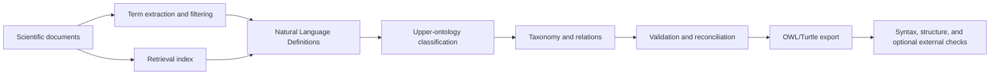

# PreSaltOntoLearn — Research Overview

## Purpose

PreSaltOntoLearn is an LLM-assisted pipeline for learning a domain ontology
from scientific documents. The research case study focuses on Brazilian
Pre-Salt petroleum geology.

The pipeline identifies candidate terms, writes Natural Language Definitions
(NLDs), maps terms to upper-ontology categories, organizes classes and
individuals, extracts relations, applies a validation stage, and exports an
OWL/Turtle ontology.

The project investigates whether retrieval-grounded Aristotelian NLDs improve
upper-ontology classification compared with simpler term representations.
This design is motivated by the results reported by Lopes Junior (2024), which
found NLD-based representations effective for foundational-ontology
classification. The present study evaluates that approach in a different
domain and pipeline architecture.

## Research scope

The case study covers concepts used to describe Pre-Salt carbonate reservoirs,
including geological materials, structures, processes, qualities, depositional
settings, stratigraphic units, fields, basins, and geological time intervals.

The ontology is anchored to:

| Ontology | Role in this project |
|---|---|
| BFO | Foundational distinctions such as material entity, process, quality, site, and realizable entity |
| GeoCore | General geological categories |
| GeoReservoir | Petroleum-reservoir categories |
| RO | General relations reused during relation extraction and validation |

The classification order is GeoReservoir, then GeoCore, then BFO. This is a
project-specific prioritization intended to select the most specific configured
category that fits a term.

## Pipeline

| Phase | What the pipeline does |
|---|---|
| Ingest and retrieve | Converts PDFs to Markdown and indexes document passages for retrieval |
| Extract and filter | Extracts candidate terms, counts document occurrence, and applies a corpus-specific frequency threshold |
| Define | Retrieves relevant passages and generates an Aristotelian NLD for each retained term |
| Classify | Maps each term and NLD through the configured upper-ontology cascade |
| Construct | Builds a taxonomy and proposes object-property relations |
| Validate | Reviews class worthiness, taxonomy placement, duplicate meanings, relation correctness, and relation scope |
| Emit and check | Exports OWL/Turtle and checks syntax and structural conditions; OOPS! and HermiT are optional |

For the reported Pre-Salt run, the source corpus contained 82 documents and a
minimum document frequency of 5 retained 407 terms before later pipeline
stages. These values describe this experiment; they are not recommended as
universal ontology-learning thresholds.

The public
[corpus bibliography](../evaluation_study/corpus_bibliography.csv)
accounts for all 82 recovered source filenames: 78 rows have confirmed DOIs,
representing 76 unique publications because two sources were duplicated.
Four sources remain explicitly marked as having no confirmed DOI. Article
files and retrieved passages are not redistributed.

## Natural Language Definitions

The pipeline uses definitions in the Aristotelian form:

> X is a Y that Z.

Here, **Y** is the proximate genus and **Z** is the differentia. Making the
genus explicit provides information for both upper-ontology classification and
taxonomy construction.

Retrieval supplies passages from the configured corpus before definition
generation. This aims to ground the generated definition in domain material,
but retrieval does not guarantee relevance or scientific correctness. The
saved context-use flag records whether the generation reported using retrieved
context.

## Evaluation design

The representation ablation compares four conditions over the same term set:

| Condition | Representation supplied to classification |
|---|---|
| A | Retrieval-grounded NLD |
| B | NLD generated without retrieval context |
| C | Term only |
| D | Raw retrieved context without an NLD |

The main comparisons are:

- A versus B: sensitivity to retrieval grounding;
- A versus C: sensitivity to the NLD representation;
- A versus D: sensitivity to converting retrieved passages into a structured
  NLD.

These comparisons measure differences between pipeline conditions. Condition A
is not treated as ground truth. Automated analyses report agreement,
sensitivity, and paired statistical tests; separate blinded expert workbooks
collect judgments about representation, categorization, taxonomy, relations,
defined classes, individuals, and meaning preservation.

Inferential expert comparisons use matched expert-term judgments: an A/B
contrast requires both ratings from the same expert for the same term, and the
four-condition correctness analysis requires decisive ratings from that expert
for all four conditions. `Unsure` remains visible in descriptive summaries but
does not change the rater composition of a paired contrast.

The public study package retains terms, generated NLDs, categories, and
context-use flags. It does not redistribute the retrieved article passages.
Exact replay of Condition D therefore requires the authorized private
full-context research record and is not a goal of the public release.

## Released ontology artifact

`output/final/presalt_ontology.ttl` is the frozen GeoPreSalt 0.1 artifact used
in the evaluation. The repository preserves its exact serialization and the
hashes of the public study inputs.

GeoPreSalt 0.1 is released as an evaluated research artifact, not as a logically
complete or generally validated domain ontology. Reasoning with the saved BFO,
GeoCore, and GeoReservoir files identified 13 unsatisfiable named classes.
The repository does not claim a complete RO-inclusive reasoning result,
ontology-wide geological correctness, or suitability as a reservoir-data
integration system.

The maintenance regression reproduces the same 1,819-triple RDF graph from the
frozen construction outputs. This establishes preservation of the evaluated
graph, not correction of its known defects.

See
[GeoPreSalt 0.1 research-release notes](geopresalt_0_1_release_notes.md)
for the artifact identity, known logical limitations, public redactions, and
validation boundaries.

## Retargeting

The software can be structurally configured for another BFO-grounded domain.
The new-domain generator supplies the current prompt interfaces, generic
BFO/RO relations, and an offline structural checker.

Passing that checker establishes that files, prompt blocks, examples, category
references, and relation configuration are internally compatible. It does not
establish that the examples, upper ontologies, competency questions, or
generated ontology are scientifically appropriate for the new domain.

## Where to continue

| Need | Document |
|---|---|
| Install, configure, run, and test the software | [`README.md`](../README.md) |
| Configure a new domain and isolated smoke run | [`SETUP.md`](../SETUP.md) |
| Understand domain files, prompt blocks, and shared relations | [`domains/README.md`](../domains/README.md) |
| Inspect the ablation and expert-evaluation package | [`evaluation_study/README.md`](../evaluation_study/README.md) |
| Review the frozen ontology’s release limits | [`docs/geopresalt_0_1_release_notes.md`](geopresalt_0_1_release_notes.md) |
