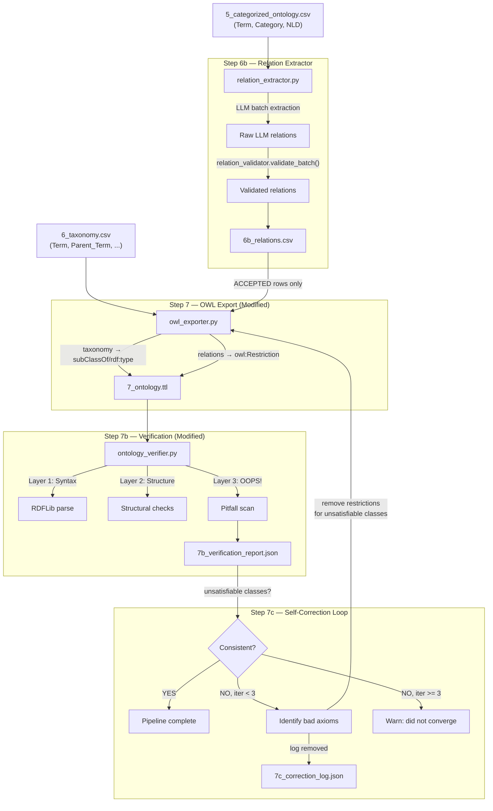

# Relation Extraction Architecture — Complete Design

## 1. Pipeline Integration Map

```
EXISTING                              NEW / MODIFIED
────────                              ──────────────
Step 0:  pdf_processor.py
Step R:  rag_setup.py
Step 1:  term_extractor.py
Step 2:  term_aggregator.py
Step 3:  term_filter.py
Step 4:  nld_generator.py
Step 5:  term_categorizer.py
Step 6:  taxonomy_builder.py
                                      Step 6b: relation_extractor.py  ← NEW MODULE
Step 7:  owl_exporter.py              Step 7:  owl_exporter.py        ← MODIFIED (add restrictions)
Step 7b: ontology_verifier.py         Step 7b: ontology_verifier.py
                                      Step 7c: self_correction loop   ← NEW (in pipeline.py)
```

---

## 2. Data Flow Contract

### 2.1 Input to Step 6b (Relation Extractor)

**Primary input:** `5_categorized_ontology.csv` (Term, Category, NLD, ...)

The extractor needs:
- Term + NLD pairs (from Step 5 output or Step 4 NLD CSV)
- Category per term (for category-aware constraint guidance)
- Known term vocabulary (all terms in the dataset, for filler resolution)

### 2.2 Output: `6b_relations.csv`

| Column | Type | Description |
|---|---|---|
| `Term` | str | Subject term (exact match to categorized CSV) |
| `Category` | str | Subject's ontology category |
| `Property` | str | BFO/RO property name (`has_part`, `participates_in`, etc.) |
| `Property_IRI` | str | Formal IRI fragment (`BFO_0000051`, `RO_0000052`, etc.) |
| `Filler` | str | Object/range term (the "some X" in the restriction) |
| `Filler_Source` | str | `domain_term` \| `upper_ontology` \| `external` |
| `Filler_Category` | str | Category of filler (looked up if domain_term, inferred if upper) |
| `Confidence` | float | LLM confidence (0.6–1.0) |
| `Evidence` | str | NLD phrase supporting extraction |
| `Validation_Status` | str | `ACCEPTED` \| `REJECTED` \| `WARNING` |
| `Validation_Reason` | str | Reason from `relation_validator.validate_relation_full()` |
| `Warnings` | str | Semicolon-separated warning messages (may be empty) |

**Key invariants:**
- Only rows with `Validation_Status == "ACCEPTED"` flow into OWL export
- Every `Filler` with `Filler_Source == "domain_term"` must exist in the vocabulary
- `Confidence >= 0.6` (enforced by prompt); validator rejects `< 0.7` by default

### 2.3 Modified Step 7 Input

`run_owl_export()` gains a new optional parameter:

```python
def run_owl_export(
    taxonomy_csv: str,
    nld_csv: str | None = None,
    relations_csv: str | None = None,   # ← NEW
    output_path: str | None = None,
):
```

### 2.4 Modified Step 7b Output

`7b_verification_report.json` gains a new layer:

```json
{
  "layers": {
    "syntax": { ... },
    "structure": { ... },
    "oops_pitfalls": { ... }
  }
}
```

### 2.5 Self-Correction Artifacts

| File | Description |
|---|---|
| `7_ontology.ttl` | OWL file (overwritten each iteration) |
| `7b_verification_report.json` | Verification report (overwritten each iteration) |
| `7c_correction_log.json` | Log of all correction iterations |
| `6b_relations_excluded.csv` | Relations removed during self-correction |

---

## 3. Complete Data Flow Diagram



---

## 4. Module Design: `relation_extractor.py`

### 4.1 Architecture

```python
# src/modules/relation_extractor.py
"""
Step 6b — Relation Extraction from NLDs.

Extracts OWL object property axioms from Aristotelian NLDs using an LLM,
validates each relation against BFO domain/range constraints, and outputs
a CSV of accepted/rejected relations for downstream OWL export.

Processing strategy:
  - Group terms by category (category-aware prompting)
  - Batch N terms per LLM call (default: 5)
  - Validate each extracted relation via relation_validator
  - Checkpoint/resume per category group
"""
```

### 4.2 Processing Flow

```
1. Load categorized CSV → DataFrame (Term, Category, NLD)
2. Filter out ERROR_* categories and terms without NLDs
3. Build known_terms vocabulary (all term names)
4. Group terms by Category
5. For each category group:
   a. Load checkpoint (completed terms for this group)
   b. Batch terms into groups of BATCH_SIZE (default 5)
   c. For each batch:
      i.   Build prompt from _RE_PROMPT_TEMPLATE (from prompt_design.md)
      ii.  Call llm_client.generate() with response_mime_type="application/json"
      iii. Parse JSON response → list of {term, relations}
      iv.  Validate len(response) == len(batch)
      v.   For each term's relations:
           - Look up filler_category (from our term→category map or upper ontology)
           - Call relation_validator.validate_relation_full()
           - Write row to 6b_relations.csv (accepted AND rejected, with status)
      vi.  Append checkpoint
6. Log summary statistics
```

### 4.3 Checkpoint Strategy

```python
def _load_checkpoint(path: str) -> tuple[set, list[dict]]:
    """Load completed terms from existing CSV."""
    if not os.path.exists(path):
        return set(), []
    df = pd.read_csv(path, encoding="utf-8-sig")
    completed = set(df["Term"].unique())
    return completed, df.to_dict("records")

def _append_rows(path: str, rows: list[dict], is_first: bool):
    """Atomic append of multiple rows (one term's relations)."""
    df = pd.DataFrame(rows)
    if is_first and not os.path.exists(path):
        df.to_csv(path, index=False, encoding="utf-8-sig")
    else:
        df.to_csv(path, mode="a", header=not os.path.exists(path),
                  index=False, encoding="utf-8-sig")
```

Unlike NLD generation (one row per term), relation extraction produces
**multiple rows per term** (one per relation). The checkpoint granularity is
still per-term: if a term has any rows, all its relations are considered done.

### 4.4 Filler Category Resolution

```python
def _resolve_filler_category(
    filler: str,
    filler_source: str,
    term_to_category: dict[str, str],
) -> str:
    """Resolve the ontological category of a filler term."""
    if filler_source == "domain_term":
        # Look up from our categorized vocabulary
        return term_to_category.get(filler, "UNKNOWN")
    elif filler_source == "upper_ontology":
        # The filler IS a category name (e.g., "Rock", "Geological Process")
        # Use it directly — validator maps categories to BFO metatypes
        return filler
    else:
        # External filler — no category info available
        # These are skipped during validation (cannot check domain/range)
        return "EXTERNAL"
```

### 4.5 Error Handling

| Scenario | Handling |
|---|---|
| LLM returns unparseable JSON | Log warning, skip batch, continue |
| LLM returns wrong array length | Log warning, match by term name where possible, skip unmatched |
| LLM returns 0 relations for a term | Write zero rows for that term; record in stats (this is VALID) |
| All relations for a term fail validation | All rows written with `REJECTED` status; term has no OWL restrictions |
| Unknown filler_source value | Treat as "external", log warning |
| Filler is "domain_term" but not in vocabulary | Set `Filler_Source = "external_corrected"`, log warning |
| API rate limit / 429 | Handled by `llm_client.generate()` retry logic |

### 4.6 Function Signature

```python
def run_relation_extraction(
    categorized_csv: str | None = None,
    output_csv: str | None = None,
) -> str:
    """
    Extract relations from NLDs and validate against BFO constraints.

    Args:
        categorized_csv: Path to Step 5 output. Default: from CATEGORIZED_LLM_TERMS env var.
        output_csv: Output path. Default: derived from input path.

    Returns:
        Path to the output CSV.
    """
```

---

## 5. OWL Exporter Modifications (Step 7)

### 5.1 New: Existential Restriction Generation

For each accepted relation row, generate an OWL existential restriction:

```
TermClass rdfs:subClassOf (property some FillerClass)
```

In rdflib:

```python
from rdflib import BNode

def _add_restriction(g: Graph, term_iri: URIRef, prop_iri: URIRef, filler_iri: URIRef):
    """Add an OWL existential restriction: term ⊑ ∃prop.filler."""
    restriction = BNode()
    g.add((restriction, RDF.type, OWL.Restriction))
    g.add((restriction, OWL.onProperty, prop_iri))
    g.add((restriction, OWL.someValuesFrom, filler_iri))
    g.add((term_iri, RDFS.subClassOf, restriction))
```

### 5.2 Property IRI Mapping

```python
# Map property names → full OWL IRIs (BFO 2020 PURL + RO)
PROPERTY_IRIS = {
    "has_part": BFO_NS["BFO_0000051"],
    "part_of": BFO_NS["BFO_0000050"],
    "has_participant": BFO_NS["BFO_0000057"],
    "participates_in": BFO_NS["BFO_0000056"],
    "inheres_in": URIRef("http://purl.obolibrary.org/obo/RO_0000052"),
    "has_quality": URIRef("http://purl.obolibrary.org/obo/RO_0000086"),
    "occurs_in": BFO_NS["BFO_0000066"],
    "derives_from": URIRef("http://purl.obolibrary.org/obo/RO_0001000"),
    "generated_by": GEOCORE_NS["generated_by"],
    "preceded_by": BFO_NS["BFO_0000062"],
    "precedes": BFO_NS["BFO_0000063"],
}
```

### 5.3 Integration Point

After the taxonomy loop and before serialization:

```python
# ── Object Property Restrictions (from relation extraction) ──
if relations_csv and os.path.exists(relations_csv):
    rel_df = pd.read_csv(relations_csv, encoding="utf-8-sig")
    accepted = rel_df[rel_df["Validation_Status"] == "ACCEPTED"]
    log.info(f"Adding {len(accepted)} object property restrictions")

    # Declare object properties
    for prop_name, prop_iri in PROPERTY_IRIS.items():
        g.add((prop_iri, RDF.type, OWL.ObjectProperty))
        g.add((prop_iri, RDFS.label, Literal(prop_name.replace("_", " "), lang="en")))

    skipped_external = 0
    for _, rel in accepted.iterrows():
        term_iri = _term_to_iri(str(rel["Term"]))
        prop_iri = PROPERTY_IRIS.get(rel["Property"])
        if prop_iri is None:
            log.warn(f"  Unknown property '{rel['Property']}' — skipped")
            continue

        filler_source = rel.get("Filler_Source", "")
        if filler_source == "external":
            # External fillers get a local IRI in our namespace
            filler_iri = _term_to_iri(str(rel["Filler"]))
            g.add((filler_iri, RDF.type, OWL.Class))
            skipped_external += 1  # track for stats but still add
        else:
            filler_iri = _term_to_iri(str(rel["Filler"]))

        _add_restriction(g, term_iri, prop_iri, filler_iri)

    if skipped_external:
        log.detail(f"  {skipped_external} restrictions use external fillers (new classes created)")
```

### 5.4 Individual Handling

Named individuals (identified by `Relationship_Type == "rdf:type"` in taxonomy)
do NOT get existential restrictions. Object property assertions for individuals
use a different OWL pattern:

```python
# For individuals: direct property assertion, not restriction
if is_individual:
    g.add((term_iri, prop_iri, filler_iri))
else:
    _add_restriction(g, term_iri, prop_iri, filler_iri)
```

---

## 7. Self-Correction Loop (Step 7c)

### 7.1 Design Philosophy

**Remove, don't repair.** When the reasoner finds unsatisfiable classes, the
self-correction loop identifies which object property restrictions are responsible
and removes them. We do NOT use the LLM to suggest corrections because:

1. The LLM already had its chance during extraction — it produced the bad axiom
2. LLM "corrections" can introduce new inconsistencies
3. Removal is deterministic, auditable, and always safe (monotonic: fewer axioms
   can't create *new* inconsistencies that weren't already there)

### 7.2 Tracing Unsatisfiable Classes to Axioms

When the reasoner reports class `X` as unsatisfiable, the cause is typically:
1. `X ⊑ ∃P.Y` where `P` has incompatible domain/range with `X`'s position
2. `X ⊑ ∃P.Y` combined with disjointness axioms makes `X ≡ ⊥`
3. Multiple restrictions on `X` create a logically impossible conjunction

**Strategy: Remove ALL object property restrictions on unsatisfiable classes.**

This is conservative (might remove valid axioms alongside the bad one) but:
- Guarantees convergence (finite axioms, each iteration removes at least one)
- Avoids combinatorial explosion of testing axiom subsets
- Auditable: every removed axiom is logged with the reason

### 7.3 Algorithm

```python
MAX_CORRECTION_ITERATIONS = 3

def run_self_correction(
    taxonomy_csv: str,
    relations_csv: str,
    owl_path: str,
    verify_kwargs: dict,
) -> dict:
    """
    Self-correction loop: export → verify → remove bad axioms → repeat.

    Returns:
        Correction log dict with iteration details.
    """
    correction_log = {
        "iterations": [],
        "total_axioms_removed": 0,
        "converged": False,
        "final_status": None,
    }

    # Track which relations to exclude (accumulates across iterations)
    excluded_relations = set()  # (Term, Property, Filler) tuples
    excluded_rows = []          # For 6b_relations_excluded.csv

    for iteration in range(1, MAX_CORRECTION_ITERATIONS + 1):
        iter_log = {"iteration": iteration, "removed": [], "status": None}

        # ── Step A: Export OWL (with current exclusions) ──
        owl_path = run_owl_export(
            taxonomy_csv,
            relations_csv=relations_csv,
            output_path=owl_path,
            exclude_relations=excluded_relations,  # NEW parameter
        )

        # ── Step B: Verify (with reasoner) ──
        report = run_ontology_verification(owl_path, **verify_kwargs)
        reasoner = report["layers"].get("reasoner", {})

        if reasoner.get("is_consistent", True):
            iter_log["status"] = "CONSISTENT"
            correction_log["iterations"].append(iter_log)
            correction_log["converged"] = True
            correction_log["final_status"] = "PASS"
            break

        # ── Step C: Identify axioms to remove ──
        unsat_iris = set(reasoner.get("unsatisfiable_classes", []))
        if not unsat_iris:
            # Globally inconsistent but no specific classes flagged
            iter_log["status"] = "GLOBALLY_INCONSISTENT"
            iter_log["action"] = "Remove ALL relation axioms"
            # Nuclear option: exclude everything
            rel_df = pd.read_csv(relations_csv, encoding="utf-8-sig")
            for _, r in rel_df.iterrows():
                key = (r["Term"], r["Property"], r["Filler"])
                if key not in excluded_relations:
                    excluded_relations.add(key)
                    iter_log["removed"].append({
                        "term": r["Term"], "property": r["Property"],
                        "filler": r["Filler"], "reason": "global_inconsistency"
                    })
            correction_log["iterations"].append(iter_log)
            correction_log["final_status"] = "REMOVED_ALL"
            break

        # Match unsatisfiable IRIs to terms in relations CSV
        rel_df = pd.read_csv(relations_csv, encoding="utf-8-sig")
        accepted = rel_df[rel_df["Validation_Status"] == "ACCEPTED"]

        for _, rel in accepted.iterrows():
            term_iri = str(_term_to_iri(rel["Term"]))
            filler_iri = str(_term_to_iri(rel["Filler"]))

            if term_iri in unsat_iris or filler_iri in unsat_iris:
                key = (rel["Term"], rel["Property"], rel["Filler"])
                if key not in excluded_relations:
                    excluded_relations.add(key)
                    reason = (
                        f"term_unsatisfiable:{term_iri}" if term_iri in unsat_iris
                        else f"filler_unsatisfiable:{filler_iri}"
                    )
                    iter_log["removed"].append({
                        "term": rel["Term"], "property": rel["Property"],
                        "filler": rel["Filler"], "reason": reason,
                    })
                    excluded_rows.append(rel.to_dict() | {"Exclusion_Reason": reason})

        iter_log["status"] = f"REMOVED_{len(iter_log['removed'])}_AXIOMS"
        correction_log["iterations"].append(iter_log)

        if not iter_log["removed"]:
            # Unsatisfiable classes don't map to any relation axioms
            # (caused by taxonomy structure or disjointness, not relations)
            correction_log["final_status"] = "UNRESOLVABLE"
            break

    else:
        correction_log["final_status"] = "DID_NOT_CONVERGE"

    correction_log["total_axioms_removed"] = len(excluded_relations)
    return correction_log
```

### 7.4 Convergence Guarantee

- Each iteration removes ≥1 restriction (or terminates)
- Total restrictions are finite (bounded by |relations| from 6b CSV)
- Therefore: terminates in at most min(MAX_ITERATIONS, |accepted_relations|) steps
- In practice: most inconsistencies resolve in 1 iteration

### 7.5 What the Self-Correction Does NOT Do

- Does NOT modify `6b_relations.csv` (that's the LLM's raw output — immutable)
- Does NOT use LLM to suggest fixes (deterministic removal only)
- Does NOT remove taxonomy axioms (only object property restrictions)
- Does NOT add new axioms to "fix" missing ones

---

## 8. Pipeline.py Integration

### 8.1 New CLI Flags

```python
# New argparse arguments
parser.add_argument(
    "--relations",
    type=str,
    default=None,
    help="Extract relations from a categorized CSV (e.g., output/5_categorized_ontology.csv)",
)
parser.add_argument(
    "--skip-relations",
    action="store_true",
    help="Skip Step 6b relation extraction in standard pipeline",
)
parser.add_argument(
    "--skip-reasoner",
    action="store_true",
    help="Skip Layer 4 reasoner check during verification",
)
parser.add_argument(
    "--max-correction-iterations",
    type=int,
    default=3,
    help="Maximum self-correction iterations (default: 3)",
)
```

### 8.2 Standalone Flag Handling

```python
# --- Relation extraction (standalone) ---
if args.relations:
    from src.modules.relation_extractor import run_relation_extraction
    run_relation_extraction(args.relations)
    return
```

### 8.3 Standard Pipeline Integration

```python
# In the standard pipeline flow, after Step 6:

log.banner(6, "Taxonomy Builder")
from src.modules.taxonomy_builder import run_taxonomy_builder
cat_csv = os.environ["CATEGORIZED_LLM_TERMS"]
run_taxonomy_builder(cat_csv)

# ── Step 6b: Relation Extraction ──
relations_csv = None
if not args.skip_relations:
    log.banner("6b", "Relation Extraction")
    from src.modules.relation_extractor import run_relation_extraction
    relations_csv = run_relation_extraction(cat_csv)

# ── Step 7: OWL Export ──
log.banner(7, "OWL Export")
from src.modules.owl_exporter import run_owl_export
tax_csv = (
    os.path.splitext(cat_csv)[0]
    .replace("5_categorized_ontology", "6_taxonomy") + ".csv"
)
owl_path = run_owl_export(tax_csv, relations_csv=relations_csv)

# ── Step 7b: Ontology Verification ──
from src.modules.ontology_verifier import run_ontology_verification
report = run_ontology_verification(
    owl_path,
    skip_oops=args.skip_oops,
    skip_reasoner=args.skip_reasoner,
)

# ── Step 7c: Self-Correction Loop ──
if (
    relations_csv
    and not args.skip_reasoner
    and report.get("layers", {}).get("reasoner", {}).get("is_consistent") is False
):
    log.banner("7c", "Self-Correction")
    from src.modules.owl_exporter import run_owl_export as owl_export
    from src.modules.ontology_verifier import run_ontology_verification as verify

    excluded = set()
    excluded_rows = []
    correction_log = {"iterations": [], "converged": False}

    for iteration in range(1, args.max_correction_iterations + 1):
        log.info(f"Self-correction iteration {iteration}/{args.max_correction_iterations}")

        # Identify restrictions to remove based on unsatisfiable classes
        unsat = report["layers"]["reasoner"].get("unsatisfiable_classes", [])
        if not unsat:
            log.warn("Global inconsistency — removing all relation axioms")
            # Load and exclude all
            import pandas as pd
            rel_df = pd.read_csv(relations_csv, encoding="utf-8-sig")
            for _, r in rel_df[rel_df["Validation_Status"] == "ACCEPTED"].iterrows():
                excluded.add((r["Term"], r["Property"], r["Filler"]))
        else:
            # Map unsatisfiable IRIs back to relation rows
            from src.modules.owl_exporter import _term_to_iri
            import pandas as pd
            rel_df = pd.read_csv(relations_csv, encoding="utf-8-sig")
            for _, r in rel_df[rel_df["Validation_Status"] == "ACCEPTED"].iterrows():
                t_iri = str(_term_to_iri(r["Term"]))
                f_iri = str(_term_to_iri(r["Filler"]))
                if t_iri in unsat or f_iri in unsat:
                    key = (r["Term"], r["Property"], r["Filler"])
                    if key not in excluded:
                        excluded.add(key)
                        excluded_rows.append(r.to_dict())
                        log.detail(f"  Excluding: {r['Term']} {r['Property']} {r['Filler']}")

        new_count = len(excluded) - sum(
            len(it.get("removed", [])) for it in correction_log["iterations"]
        )
        log.info(f"  Removed {new_count} axioms this iteration")

        # Re-export and re-verify
        owl_path = owl_export(tax_csv, relations_csv=relations_csv,
                              output_path=owl_path, exclude_relations=excluded)
        report = verify(owl_path, skip_oops=True, skip_reasoner=False)

        correction_log["iterations"].append({
            "iteration": iteration,
            "removed_count": new_count,
            "is_consistent": report["layers"]["reasoner"].get("is_consistent"),
        })

        if report["layers"]["reasoner"].get("is_consistent", False):
            correction_log["converged"] = True
            log.success(f"  Converged after {iteration} iteration(s)")
            break
    else:
        log.warn(f"  Self-correction did not converge after {args.max_correction_iterations} iterations")

    # Save correction log
    import json
    log_path = os.path.join(os.path.dirname(owl_path), "7c_correction_log.json")
    with open(log_path, "w", encoding="utf-8") as f:
        json.dump(correction_log, f, indent=2)

    # Save excluded relations
    if excluded_rows:
        excl_path = os.path.join(os.path.dirname(relations_csv), "6b_relations_excluded.csv")
        pd.DataFrame(excluded_rows).to_csv(excl_path, index=False, encoding="utf-8-sig")
        log.info(f"  Excluded relations saved to {excl_path}")

log.success("\nPipeline complete.")
```

---

## 9. Ablation Study Impact

### 9.1 Should Relations Run Per-Condition?

**YES.** This is scientifically valuable because:

1. Different NLD quality → different relation extraction quality
2. Conditions C/D have no NLDs → relation extraction would be minimal/impossible
3. Measuring "NLD condition → axiom quality" strengthens the thesis claim

### 9.2 Ablation Integration Design

The ablation study currently runs Steps 4-5 per condition. Extend to Steps 4-6b:

```python
# In ablation_study.py — after categorization phase:

# Phase 3: Relation extraction per condition (A and B only — C/D have no NLDs)
for cond in ["A", "B"]:
    cat_csv = _cat_path(cond)
    rel_csv = os.path.join(OUTPUT_DIR, f"rel_{cond}.csv")
    run_relation_extraction(cat_csv, output_csv=rel_csv)
```

Conditions C and D don't produce NLDs, so relation extraction is meaningless for them.
The ablation analysis compares:
- **A vs B**: RAG impact on relation extraction quality
- **A/B vs C/D**: NLD presence → ability to extract relations at all

### 9.3 New Ablation Metrics

| Metric | Description |
|---|---|
| `relations_per_term` | Mean extracted relations per term |
| `accepted_rate` | % of extracted relations passing validation |
| `domain_range_reject_rate` | % rejected for domain/range violations |
| `relation_type_distribution` | Frequency of each property type |
| `filler_source_distribution` | domain_term vs upper_ontology vs external |
| `confidence_distribution` | Mean/median confidence score |

---

## 10. Error Handling Matrix

| Scenario | Detection | Response | Severity |
|---|---|---|---|
| LLM returns 0 relations for batch | `len(parsed) == 0` or all terms have empty `relations` | Log info, write zero-relation rows, continue | Normal (expected for ~30% of terms) |
| LLM returns unparseable JSON | `json.JSONDecodeError` | Log warning, skip batch, retry once | Recoverable |
| LLM returns wrong array length | `len(parsed) != len(batch)` | Match by term name, log mismatch | Recoverable |
| All relations for a term fail validation | All rows `REJECTED` | Normal operation — term gets no restrictions | Normal |
| Filler references unknown term | Filler_Source should be "domain_term" but not in vocab | Reclassify as "external", log warning | Minor |
| Reasoner crashes | Java not found or HermiT exception | Log error, skip Layer 4, report `SKIP` | Degraded (pipeline continues) |
| Java not available | `FileNotFoundError` on `java` | Skip Layer 4 with clear error message | Degraded |
| Self-correction doesn't converge | `iteration >= MAX_ITERATIONS` | Warn, save partial results, continue | Important (thesis reports this) |
| Global inconsistency (no specific unsat classes) | Reasoner reports inconsistent but empty unsat list | Remove ALL relation axioms, log nuclear option | Critical but handled |
| owlready2 not installed | `ImportError` | Skip Layer 4, suggest install command | Degraded |
| Empty relations CSV (no accepted relations) | `len(accepted) == 0` | Skip restriction generation, OWL has taxonomy only | Normal |

---

## 11. Complete File Inventory

### New Files

| File | Type | Description |
|---|---|---|
| `src/modules/relation_extractor.py` | Module | Step 6b: LLM relation extraction + validation |
| `output/6b_relations.csv` | Data | All extracted relations (accepted + rejected) |
| `output/6b_relations_excluded.csv` | Data | Relations removed by self-correction |
| `output/7c_correction_log.json` | Report | Self-correction iteration log |
| `docs/relation_extraction_architecture.md` | Doc | This document |

### Modified Files

| File | Changes |
|---|---|
| `pipeline.py` | Add imports, CLI flags, Step 6b/7c integration |
| `src/modules/owl_exporter.py` | Add `relations_csv` + `exclude_relations` params, restriction generation |
| `src/modules/ontology_verifier.py` | Add Layer 4 reasoner, `skip_reasoner` param |
| `requirements.txt` | Add `owlready2` |
| `docs/CONTEXT.md` | Add Step 6b/7c descriptions |
| `docs/OVERVIEW.md` | Update pipeline table |
| `README.md` | Add new CLI flags, update project structure |

### Ablation-Specific Files

| File | Description |
|---|---|
| `output/ablation/rel_A.csv` | Relations from condition A (RAG+NLD) |
| `output/ablation/rel_B.csv` | Relations from condition B (no-RAG NLD) |

---

## 12. Environment Variables

| Variable | Required | Default | Description |
|---|---|---|---|
| `RELATION_BATCH_SIZE` | No | `5` | Terms per LLM batch for relation extraction |
| `RELATION_CONFIDENCE_THRESHOLD` | No | `0.7` | Minimum confidence to accept a relation |
| `JAVA_HOME` | No | system | Java path for HermiT reasoner |
| `MAX_CORRECTION_ITERATIONS` | No | `3` | Self-correction loop limit |

---

## 13. Implementation Order

1. **`relation_extractor.py`** — New module (can be tested standalone)
2. **`owl_exporter.py`** — Add restriction generation (test with hand-crafted CSV)
3. **`ontology_verifier.py`** — Add Layer 4 reasoner (test with known-good/bad TTL)
4. **`pipeline.py`** — Wire everything together + self-correction loop
5. **`requirements.txt`** — Add owlready2
6. **Docs** — Update CONTEXT.md, OVERVIEW.md, README.md
7. **E2E test** — Update `test/run_e2e_test.py` with Step 6b test data
8. **Ablation** — Extend `ablation_study.py` Phase 3
